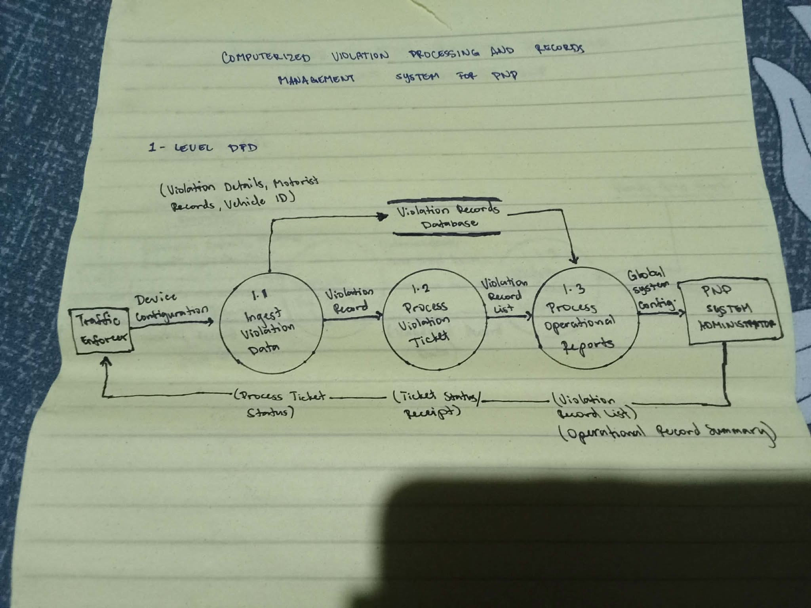

## 📌 Stage 1 – Level 1 Data Flow Diagram (DFD)

**Description:**

The Level 1 Data Flow Diagram decomposes the Context Diagram into the system's major functional processes. It illustrates how data flows between the Driver Verification, Violation Processing, Citation Management, Records Management, Reporting modules, and the database.

