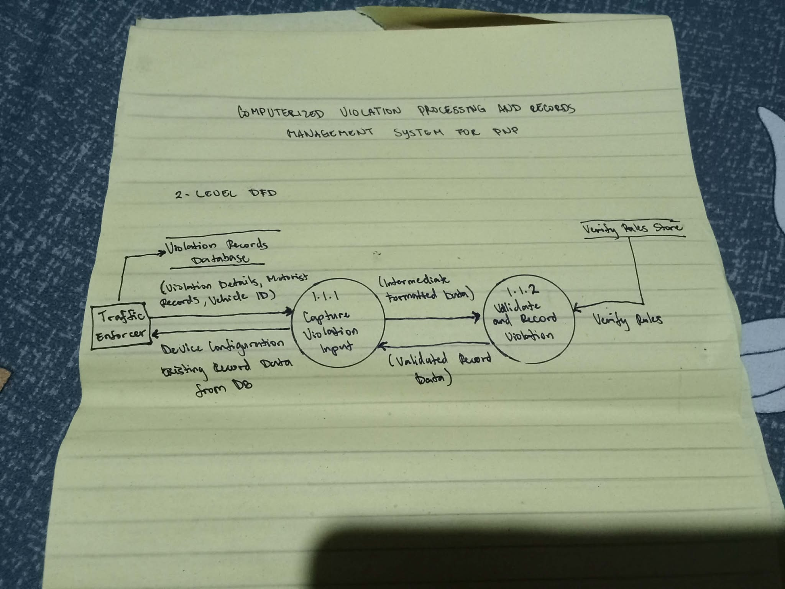

## 📌 Stage 2 – Level 2 Data Flow Diagram (DFD)

**Description:**

The Level 2 Data Flow Diagram provides a more detailed view of the individual processes shown in the Level 1 DFD. It explains how each subprocess handles data during driver verification, violation validation, citation generation, payment recording, and database updates.

