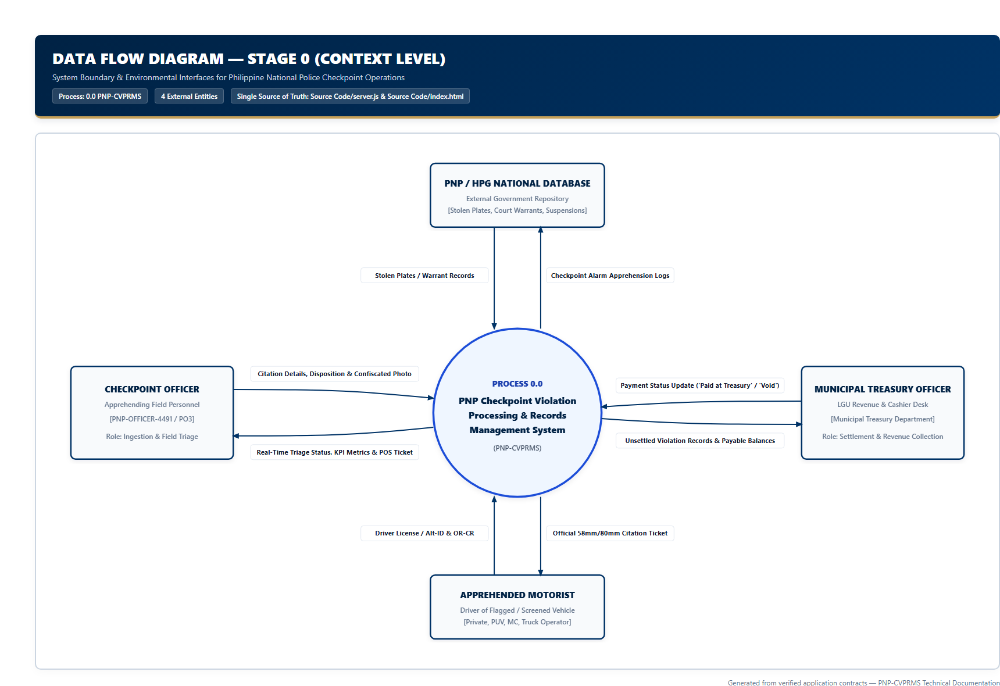
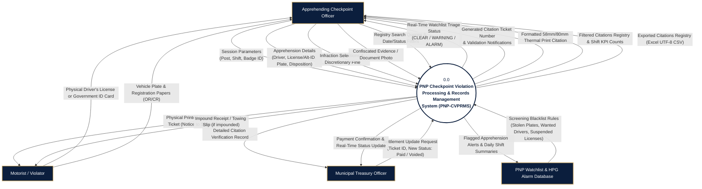

# Data Flow Diagram (DFD) — Stage 0: Context Diagram

**System**: PNP Checkpoint Violation Processing & Records Management System (PNP-CVPRMS)  
**Level**: Stage 0 (Context Level Diagram)  
**Source of Truth**: [`Source Code/server.js`](file:///c:/Users/emman/PNP-CVPRMS/Source%20Code/server.js) & [`Source Code/index.html`](file:///c:/Users/emman/PNP-CVPRMS/Source%20Code/index.html)

---

## 1. Overview

The Context Level Data Flow Diagram (Stage 0) represents the entire PNP-CVPRMS application as a single conceptual process (`0.0`), identifying its operational boundary, primary external entities, input data flows, and output data flows.

---

## 2. Context Diagram Visual & Mermaid Representation

---

## 3. Entity & Flow Catalog

### 3.1 External Entities

| Entity Identifier | Entity Name | Description |
| :--- | :--- | :--- |
| **`CO`** | **Apprehending Checkpoint Officer** | PNP personnel deployed at field checkpoint post. Configures active shifts, inputs motorist data, selects infractions, attaches photo evidence, inspects records, and triggers thermal receipt printing. |
| **`MO`** | **Motorist / Violator** | Driver apprehended during checkpoint screening. Presents credentials, receives citation, and is notified of the 7-day settlement period. |
| **`TO`** | **Municipal Treasury Officer** | Administrative personnel at municipal hall. Audits citations, processes fine collections, and updates settlement status (`Settled / Paid at Treasury` or `Voided / Contested`). |
| **`HPG`** | **PNP Watchlist & HPG Database** | National police repository containing Highway Patrol Group (HPG) stolen vehicle alarms, court warrants, and delinquent license lists. |

### 3.2 Key Data Flows

| Direction | Flow Name | Composition / Attributes |
| :--- | :--- | :--- |
| `CO -> CVPRMS` | **Apprehension Details** | `driver_name`, `license_number`, `id_type`, `id_number`, `plate_number`, `vehicle_type`, `vehicle_disposition`, `impound_receipt_no` |
| `CO -> CVPRMS` | **Infraction & Fine Data** | `violation_types[]`, `fine_amount`, `fine_override` (0 or 1) |
| `CO -> CVPRMS` | **Evidence Photo** | Base64-encoded JPEG image string (client downscaled to max 1200px) |
| `CVPRMS -> CO` | **Screening Triage Result** | `status` (clear/warning/alarm), `status_label`, `flags[]` |
| `CVPRMS -> CO` | **Thermal Print Receipt** | Formatted 72mm ESC/POS compatible thermal view with headers, itemized fines, notice, signature lines |
| `TO -> CVPRMS` | **Settlement Request** | Record ID, `payment_status` (`'Settled / Paid at Treasury'` or `'Voided / Contested'`) |
| `CVPRMS -> TO` | **Status Confirmation** | Updated record state, KPI metrics recount |
