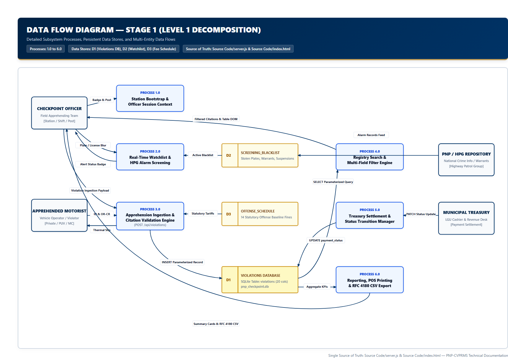
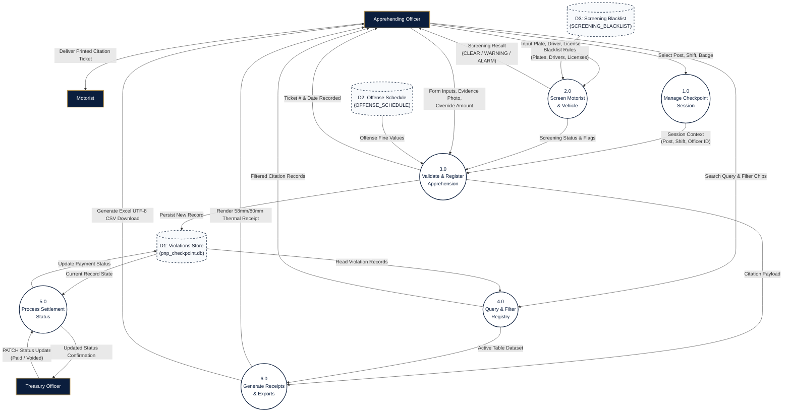

# Data Flow Diagram (DFD) — Stage 1: Level 1 Diagram

**System**: PNP Checkpoint Violation Processing & Records Management System (PNP-CVPRMS)  
**Level**: Stage 1 (Level 1 Process Decomposition)  
**Source of Truth**: [`Source Code/server.js`](file:///c:/Users/emman/PNP-CVPRMS/Source%20Code/server.js) & [`Source Code/index.html`](file:///c:/Users/emman/PNP-CVPRMS/Source%20Code/index.html)

---

## 1. Overview

The Level 1 Data Flow Diagram decomposes the root system (`0.0`) into six major functional subsystems, showing their interactions with data stores and external entities:
* **1.0**: Manage Checkpoint Session & Configuration
* **2.0**: Screen Motorist & Vehicle (Watchlist Triage)
* **3.0**: Validate & Register Violation Apprehension
* **4.0**: Query, Search & Filter Registry
* **5.0**: Process Settlement & Payment Status
* **6.0**: Generate Thermal Receipts, Reports & Exports

---

## 2. Level 1 Diagram Visual & Mermaid Representation

---

## 3. Subsystem Descriptions & Data Store Interactions

### 3.1 Process 1.0: Manage Checkpoint Session & Configuration
* **Description**: Synchronizes active checkpoint duty parameters including physical post location, shift bracket, and active officer badge. Fetches station name branding via `GET /api/config`.
* **Input**: User dropdown selections (`#sessionPost`, `#sessionShift`, `#sessionOfficer`).
* **Output**: Session metadata injected into new apprehension submissions and receipt print headers.

### 3.2 Process 2.0: Screen Motorist & Vehicle (Watchlist Triage)
* **Description**: Real-time cross-referencing of driver name, license number, and vehicle plate against blacklists. Executed on input blur on client (`evaluateLocalScreening`) and enforced authoritatively on the backend (`assessScreening`).
* **Data Store Interaction**: Reads `D3: Screening Blacklist`.
* **Output**: Tri-state classification: `CLEAR` (nominal), `WARNING` (expired registration/suspended repeat offender), or `ALARM` (HPG wanted / active arrest warrant).

### 3.3 Process 3.0: Validate & Register Apprehension
* **Description**: Central business logic engine. Enforces defensive constraints:
  - Validates motorist credentials (alternative government ID required if unlicensed).
  - Enforces mandatory impound receipts when vehicle disposition is `"Impounded"`.
  - Calculates statutory penalties from `D2: Offense Schedule` or validates officer discretionary overrides.
  - Compresses attached photographic evidence to max 1200px JPEG.
  - Generates unique ticket numbers (`PNP-${Date.now().slice(-8)}-${6_RANDOM}`) and persists to `D1: Violations Store`.
* **Route**: `POST /api/violations`.

### 3.4 Process 4.0: Query, Search & Filter Registry
* **Description**: Fetches all records from SQLite (`GET /api/violations`) or executes multi-column SQL search queries (`GET /api/violations/search?q=`). Applies client-side multi-dimensional filtering across Date (`all`, `today`, `shift`, `7days`) and Status (`all`, `flagged`, `unpaid`).
* **Data Store Interaction**: Reads `D1: Violations Store`.

### 3.5 Process 5.0: Process Settlement & Treasury Status
* **Description**: Allows authorized officers or municipal treasury personnel to update citation payment status. Validates status against allowed whitelist (`'Unsettled / Unpaid'`, `'Settled / Paid at Treasury'`, `'Voided / Contested'`).
* **Route**: `PATCH /api/violations/:id/status`.
* **Data Store Interaction**: Updates `D1: Violations Store`.

### 3.6 Process 6.0: Generate Thermal Receipts, Reports & Exports
* **Description**: Generates formatted physical outputs:
  - ESC/POS thermal printer layout (58mm/80mm, 72mm printable width) with itemized violations, statutory fines, violator and officer signature lines.
  - Client-side CSV generator with Excel UTF-8 Byte Order Mark (`\uFEFF`) containing all 17 schema fields.
  - Live KPI summary metrics (`GET /api/reports/summary`).
