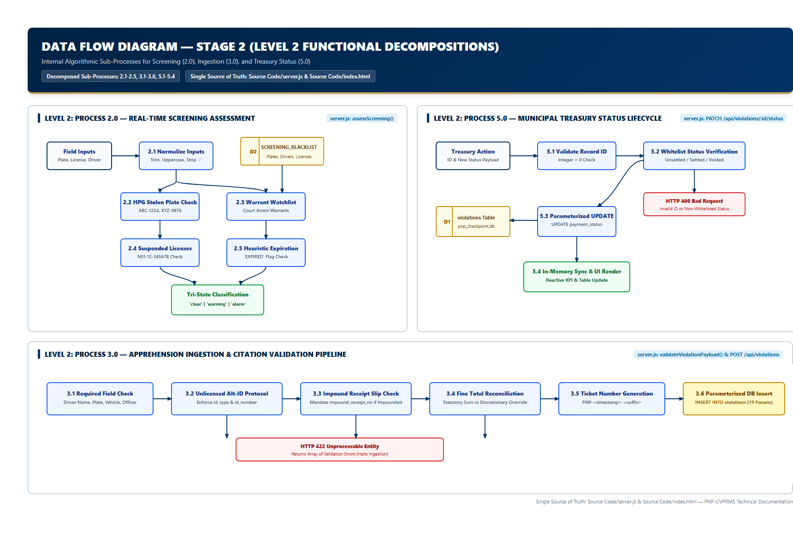
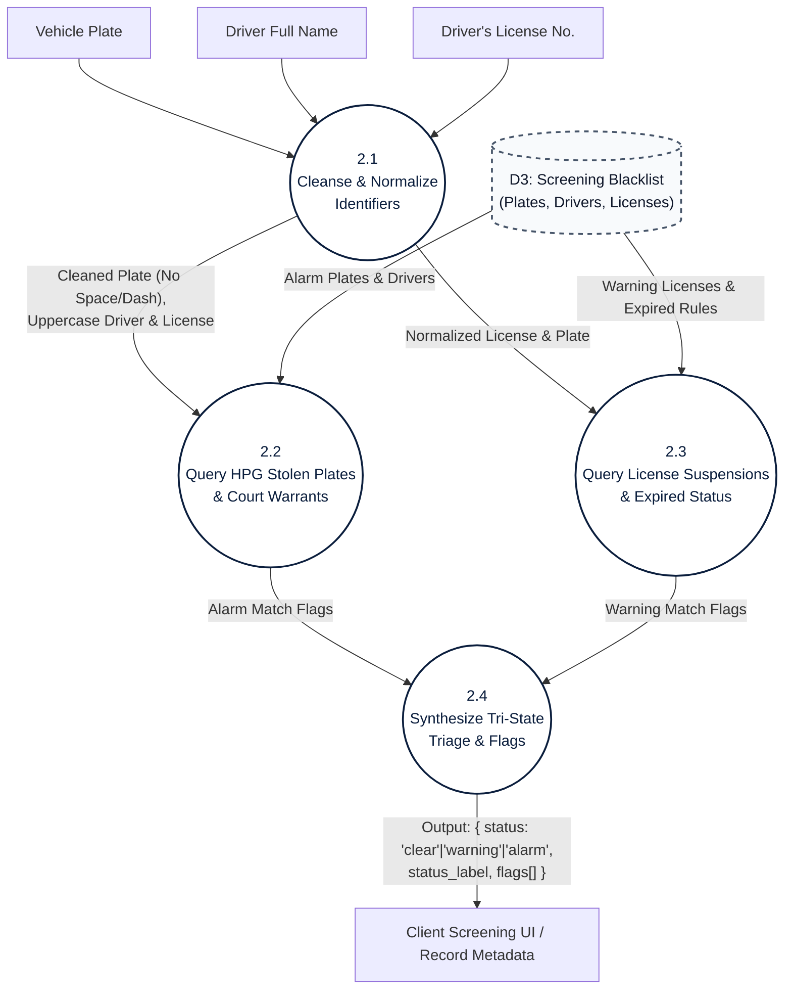
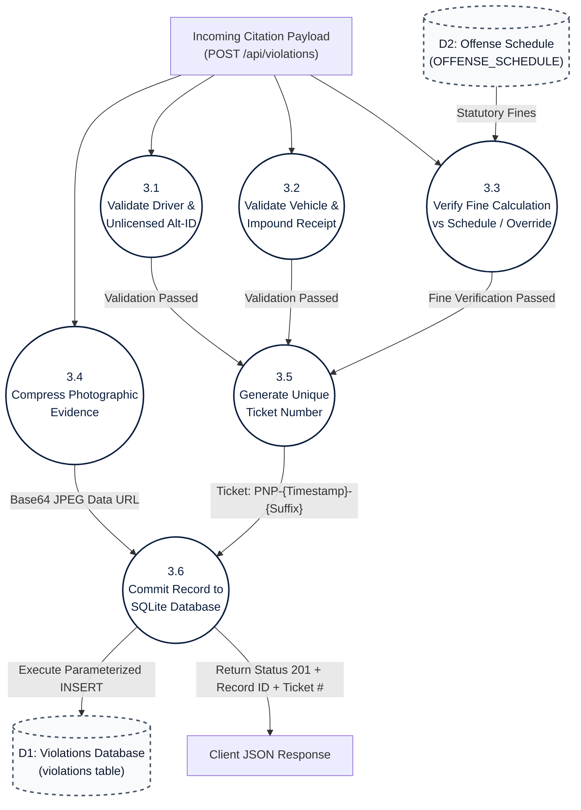
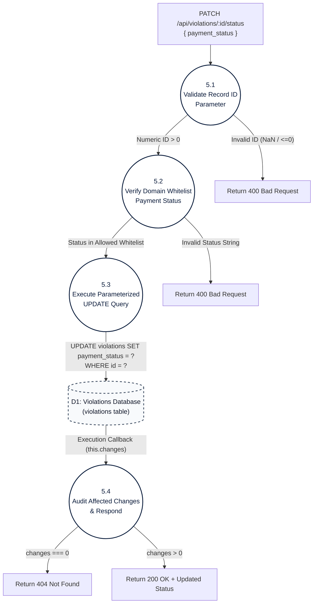

# Data Flow Diagram (DFD) — Stage 2: Level 2 Decompositions

**System**: PNP Checkpoint Violation Processing & Records Management System (PNP-CVPRMS)  
**Level**: Stage 2 (Detailed Functional Decompositions)  
**Source of Truth**: [`Source Code/server.js`](file:///c:/Users/emman/PNP-CVPRMS/Source%20Code/server.js) & [`Source Code/index.html`](file:///c:/Users/emman/PNP-CVPRMS/Source%20Code/index.html)

---

## 1. Overview

Stage 2 diagrams decompose the core Level 1 processes into their granular, atomic functional routines:
1. **Decomposition 2.0**: Watchlist Screening & HPG Stolen Vehicle Triage
2. **Decomposition 3.0**: Citation Apprehension Validation & Recording
3. **Decomposition 5.0**: Citation Settlement & Treasury Status Updates

---

## 2. Decomposition 2.0: Watchlist Screening Triage

### Process Logic (2.0):
* **2.1 Cleanse & Normalize**: Strips hyphens and whitespace from plate (`ABC 1234` -> `ABC1234`); converts driver names and license numbers to uppercase.
* **2.2 Query HPG Alarms**: Matches cleaned plate against `SCREENING_BLACKLIST.plate_numbers` and driver against `SCREENING_BLACKLIST.drivers`. If matched, assigns `isAlarm = true`.
* **2.3 Query Suspensions**: If license does not contain `'UNLICENSED'`, matches against `SCREENING_BLACKLIST.license_numbers` or scans for the keyword `'EXPIRED'`.
* **2.4 Synthesize Triage**: Returns `'alarm'` if `isAlarm == true`, `'warning'` if non-alarm flags exist, or `'clear'` with nominal diagnostic messages.

---

## 3. Decomposition 3.0: Citation Apprehension Validation & Recording

### Process Logic (3.0):
* **3.1 Driver Validation**: If "No Driver's License" is cited, ensures `license_number == 'N/A - Unlicensed'` and mandates both `id_type` and `id_number`. If licensed, ensures `license_number` is provided and is not `'N/A - Unlicensed'`.
* **3.2 Vehicle & Impound Validation**: Validates `plate_number`; if `vehicle_disposition == 'Impounded'`, verifies that `impound_receipt_no` is present.
* **3.3 Fine Calculation**: Verifies that `fine_amount > 0`. If `fine_override == 0`, asserts `Math.abs(fine_amount - totalExpected) <= 0.05`.
* **3.4 Evidence Downscaler**: Downscales attached photos via HTML5 Canvas (max 1200px width/height, 0.82 JPEG quality).
* **3.5 Ticket Generator**: Computes `PNP-${Date.now().toString().slice(-8)}-${6_RANDOM_CHARS}`.
* **3.6 DB Commitment**: Executes parameterized SQL `INSERT INTO violations (...) VALUES (?, ?, ...)`.

---

## 4. Decomposition 5.0: Citation Settlement & Treasury Status Updates

### Process Logic (5.0):
* **5.1 Validate ID**: Parses `req.params.id` as integer base 10; rejects `NaN` or values `<= 0` with HTTP 400.
* **5.2 Verify Status**: Checks if `payment_status` is in `['Unsettled / Unpaid', 'Settled / Paid at Treasury', 'Voided / Contested']`; rejects invalid transitions with HTTP 400.
* **5.3 Execute Update**: Runs parameterized SQL `UPDATE violations SET payment_status = ? WHERE id = ?`.
* **5.4 Audit Changes**: Inspects `this.changes`. If 0, returns HTTP 404 (record does not exist). If `> 0`, returns HTTP 200 with confirmation payload.
