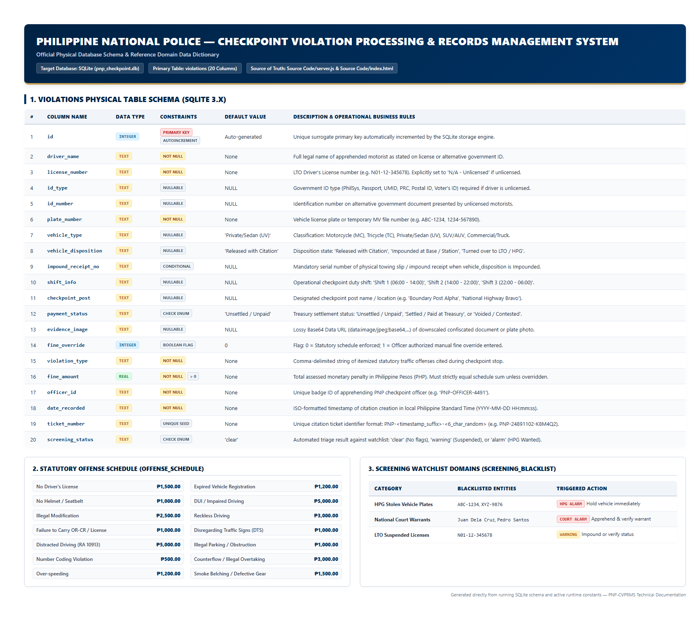

# PNP-CVPRMS Data Dictionary

**System Name**: Philippine National Police — Checkpoint Violation Processing & Records Management System (PNP-CVPRMS)  
**Database Engine**: SQLite 3 (`pnp_checkpoint.db`)  
**Backend Runtime**: Node.js / Express  
**Single Source of Truth**: [`Source Code/server.js`](file:///c:/Users/emman/PNP-CVPRMS/Source%20Code/server.js) & [`Source Code/index.html`](file:///c:/Users/emman/PNP-CVPRMS/Source%20Code/index.html)



---

## 1. Primary Database Table: `violations`

The `violations` table is the central operational data store for all apprehended traffic violations, motorist identities, vehicle classifications, financial fines, confiscated evidence, and administrative settlement statuses.

### 1.1 Column Specifications

| Column Name | Physical Data Type | SQLite Type Affinity | Nullable | Default Value | Key Type | Description & Valid Domain |
| :--- | :--- | :--- | :---: | :--- | :---: | :--- |
| `id` | `INTEGER` | `INTEGER` | **NO** | Auto-increment | **PK** | Surrogate primary key uniquely identifying each apprehension citation record. |
| `driver_name` | `VARCHAR(255)` | `TEXT` | **NO** | None | — | Full legal name of the apprehended driver/motorist (e.g., `"Juan Dela Cruz"`). Trimming enforced. |
| `license_number` | `VARCHAR(32)` | `TEXT` | **NO** | None | — | LTO Driver's License number (e.g., `"N01-12-345678"`, max 13 chars formatted) or literal string `'N/A - UNLICENSED'`. |
| `id_type` | `VARCHAR(64)` | `TEXT` | **YES** | `NULL` | — | Mandatory when unlicensed. Valid options: `'Philippine National ID'`, `'Passport'`, `'SSS/GSIS'`, `'Voter\'s ID'`, `'PRC ID'`, `'Postal ID'`, `'Senior Citizen / PWD ID'`, `'Other Valid ID'`. |
| `id_number` | `VARCHAR(64)` | `TEXT` | **YES** | `NULL` | — | Identification number of the presented government ID document (e.g., `"1234-5678-9012"`). |
| `plate_number` | `VARCHAR(16)` | `TEXT` | **NO** | None | — | Vehicle registration plate or MV file number (e.g., `"ABC 1234"`, `"XYZ-9876"`). Max 16 characters, uppercase. |
| `vehicle_type` | `VARCHAR(64)` | `TEXT` | **YES** | `'Private/Sedan (UV)'` | — | LTO classification. Valid options: `'Private/Sedan (UV)'`, `'Motorcycle (MC)'`, `'Tricycle (TC)'`, `'Commercial/Truck (HVF)'`. |
| `vehicle_disposition` | `VARCHAR(64)` | `TEXT` | **YES** | `'Released with Citation'` | — | Action taken regarding the vehicle: `'Released with Citation'`, `'Impounded'`, `'Turned Over to HPG'`. |
| `impound_receipt_no` | `VARCHAR(64)` | `TEXT` | **YES** | `NULL` | — | Impound receipt or towing slip number (e.g., `"IMP-2026-0041"`). **Mandatory** when `vehicle_disposition == 'Impounded'`. |
| `shift_info` | `VARCHAR(64)` | `TEXT` | **YES** | `NULL` | — | Active police duty shift: `'Shift 1: 06:00 - 14:00 (Day)'`, `'Shift 2: 14:00 - 22:00 (Afternoon)'`, `'Shift 3: 22:00 - 06:00 (Night)'`. |
| `checkpoint_post` | `VARCHAR(128)` | `TEXT` | **YES** | `NULL` | — | Physical checkpoint installation: `'Boundary Post - Brgy. San Nicolas Norte'`, `'Checkpoint 1 - Poblacion Plaza Junction'`, `'Checkpoint 2 - MacArthur Highway Bypass'`, `'Mobile Checkpoint Alpha'`. |
| `payment_status` | `VARCHAR(64)` | `TEXT` | **YES** | `'Unsettled / Unpaid'` | — | Citation financial status: `'Unsettled / Unpaid'`, `'Settled / Paid at Treasury'`, `'Voided / Contested'`. |
| `evidence_image` | `MEDIUMTEXT` | `TEXT` | **YES** | `NULL` | — | Base64-encoded Data URL (`data:image/jpeg;base64,...`) of downscaled (max 1200px) photographic evidence or confiscated document. |
| `fine_override` | `INTEGER` | `INTEGER` | **YES** | `0` | — | Binary flag indicating fine calculation mode: `0` = automated statutory schedule, `1` = manual officer discretion override. |
| `violation_type` | `TEXT` | `TEXT` | **NO** | None | — | Comma-delimited list of itemized traffic infractions apprehended (e.g., `"No Driver's License, No Helmet / Seatbelt"`). |
| `fine_amount` | `DOUBLE / REAL`| `REAL` | **NO** | None | — | Total monetary penalty in Philippine Peso (PHP). Must be finite numerical value `> 0`. |
| `officer_id` | `VARCHAR(64)` | `TEXT` | **NO** | None | — | Badge/ID of apprehending police officer (e.g., `"PNP-OFFICER-4491"`). |
| `date_recorded` | `VARCHAR(19)` | `TEXT` | **NO** | None | — | ISO-like local datetime stamp formatted as `YYYY-MM-DD HH:mm:ss`. |
| `ticket_number` | `VARCHAR(32)` | `TEXT` | **YES** | `NULL` | — | Unique citation ticket identifier generated as `PNP-{8_DIGIT_TIMESTAMP}-{6_CHAR_ALPHANUMERIC}`. |
| `screening_status` | `VARCHAR(32)` | `TEXT` | **YES** | `'clear'` | — | Real-time automated watchlist triage evaluation: `'clear'`, `'warning'`, `'alarm'`. |

---

## 2. In-Memory Data Structures & Constants

### 2.1 Statutory Offense Schedule (`OFFENSE_SCHEDULE`)

Configured in [`server.js:14-29`](file:///c:/Users/emman/PNP-CVPRMS/Source%20Code/server.js#L14-L29) and mirrored in [`index.html:1290-1305`](file:///c:/Users/emman/PNP-CVPRMS/Source%20Code/index.html#L1290-L1305):

| Offense Key | Statutory Fine (PHP) | Statutory Legal Basis / Category |
| :--- | :---: | :--- |
| `No Driver's License` | ₱1,500.00 | RA 4136 / LTO Joint Administrative Order (JAO 2014-01) |
| `Failure to Carry Driver's License / OR-CR` | ₱1,000.00 | JAO 2014-01 / Failure to present documents |
| `Expired Vehicle Registration` | ₱1,200.00 | Delinquent registration / Unregistered motor vehicle |
| `No Helmet / Seatbelt` | ₱1,000.00 | RA 10054 (Motorcycle Helmet Act) / RA 8750 (Seat Belts Use Act) |
| `Disregarding Traffic Signs (DTS) / Red Light Violation`| ₱1,000.00 | Traffic control device disobedience |
| `Distracted Driving (RA 10913 - Mobile Device Use)` | ₱5,000.00 | Republic Act 10913 (Anti-Distracted Driving Act) |
| `Illegal Parking / Obstruction` | ₱1,000.00 | Road clearing and sidewalk obstruction ordinances |
| `Unified Vehicular Volume Reduction Program (Number Coding)` | ₱500.00 | Local municipal traffic management coding scheme |
| `Reckless Driving / Counterflow (Illegal Overtaking)` | ₱3,000.00 | Dangerous overtaking / counterflow navigation |
| `Reckless Driving` | ₱3,000.00 | General reckless driving apprehension |
| `Over-speeding` | ₱1,200.00 | Municipal / Highway speed limit violation |
| `Defective Equipment / Smoke Belching` | ₱1,500.00 | RA 8749 (Clean Air Act) / Defective safety lights/brakes |
| `Driving Under the Influence (DUI)` | ₱5,000.00 | Republic Act 10586 (Anti-Drunk and Drugged Driving Act) |
| `Illegal Modification` | ₱2,500.00 | Unregistered exhaust, LED lights, chassis alteration |

### 2.2 Watchlist Screening Blacklist (`SCREENING_BLACKLIST`)

Configured in [`server.js:31-35`](file:///c:/Users/emman/PNP-CVPRMS/Source%20Code/server.js#L31-L35):

| Domain | Blacklisted Values | Severity Tier | Triggered Alert Message |
| :--- | :--- | :---: | :--- |
| `plate_numbers` | `['ABC-1234', 'XYZ-9876']` | **ALARM** | *"Vehicle plate matches an active HPG Alarm / Stolen Vehicle record."* |
| `drivers` | `['Juan Dela Cruz', 'Pedro Santos']` | **ALARM** | *"Driver matches an active National Police Watchlist / Court Warrant."* |
| `license_numbers` | `['N01-12-345678']` | **WARNING** | *"License record matches a flagged suspension or repeat offender record."* |
| Keyword scan | Contains `'EXPIRED'` in license or plate | **WARNING** | *"License or plate indicates expired status requiring verification."* |

---

## 3. Session & Environment State Schema

Managed in backend configuration (`/api/config`) and frontend session bar:

| Variable / Parameter | Source | Type | Valid Values | Description |
| :--- | :--- | :--- | :--- | :--- |
| `STATION_NAME` | `process.env.STATION_NAME` | String | String | Name of administering police station (Default: `"Agoo Municipal Police Station"`). |
| `PORT` | `process.env.PORT` | Integer | `1` to `65535` | Listening port for Express web server (Default: `3000`). |
| `sessionPost` | Client DOM (`#sessionPost`) | String | 4 Presets | Active physical post for operational session. |
| `sessionShift` | Client DOM (`#sessionShift`) | String | 3 Presets | Current active shift (Shift 1 / Shift 2 / Shift 3). |
| `sessionOfficer` | Client DOM (`#sessionOfficer`)| String | Badge string | Officer identifier assigned to newly logged apprehensions. |

---

## 4. API Request / Response Payload Schemas

### 4.1 Citation Registration: `POST /api/violations`

```json
{
  "driver_name": "Juan Dela Cruz",
  "license_number": "N01-12-345678",
  "id_type": null,
  "id_number": null,
  "plate_number": "ABC 1234",
  "vehicle_type": "Private/Sedan (UV)",
  "vehicle_disposition": "Released with Citation",
  "impound_receipt_no": null,
  "shift_info": "Shift 1: 06:00 - 14:00 (Day)",
  "checkpoint_post": "Boundary Post - Brgy. San Nicolas Norte",
  "evidence_image": "data:image/jpeg;base64,...",
  "fine_override": 0,
  "violation_type": "No Helmet / Seatbelt, Over-speeding",
  "violation_types": ["No Helmet / Seatbelt", "Over-speeding"],
  "fine_amount": 2200.00,
  "officer_id": "PNP-OFFICER-4491",
  "payment_status": "Unsettled / Unpaid"
}
```

**Success Response (Status 201)**:
```json
{
  "success": true,
  "message": "Violation recorded successfully.",
  "recordId": 41,
  "ticket_number": "PNP-91460744-KX9M40",
  "screening_status": "alarm",
  "screening_status_label": "ALARM / HPG WANTED",
  "screening_flags": [
    "Vehicle plate matches an active HPG Alarm / Stolen Vehicle record."
  ],
  "total_fine": 2200,
  "payment_status": "Unsettled / Unpaid",
  "date_recorded": "2026-10-06 21:05:00"
}
```

### 4.2 Status Update: `PATCH /api/violations/:id/status`

**Request Payload**:
```json
{
  "payment_status": "Settled / Paid at Treasury"
}
```

**Allowed Domain Values**:
- `"Unsettled / Unpaid"`
- `"Settled / Paid at Treasury"`
- `"Voided / Contested"`

**Success Response (Status 200)**:
```json
{
  "success": true,
  "message": "Status updated to Settled / Paid at Treasury",
  "payment_status": "Settled / Paid at Treasury"
}
```

---

## 5. Integrity Rules & Cross-Field Dependencies

1. **Unlicensed Driver Invariant**: If `violation_type` includes `"No Driver's License"`, `license_number` must equal `"N/A - Unlicensed"`, and both `id_type` and `id_number` must be non-empty strings.
2. **Impoundment Receipt Invariant**: If `vehicle_disposition == 'Impounded'`, `impound_receipt_no` cannot be null or empty string.
3. **Automated Fine Match Invariant**: If `fine_override == 0`, `fine_amount` must equal the sum of fines from `OFFENSE_SCHEDULE` within a tolerance of `±0.05 PHP`. If `fine_override == 1`, `fine_amount` must be a finite numerical value `> 0`.
4. **Ticket Uniqueness**: Every ticket number is formed with millisecond timestamp seeds and pseudo-random uppercase/digit sequences, ensuring distinct citation identifiers across concurrent checkpoint posts.
