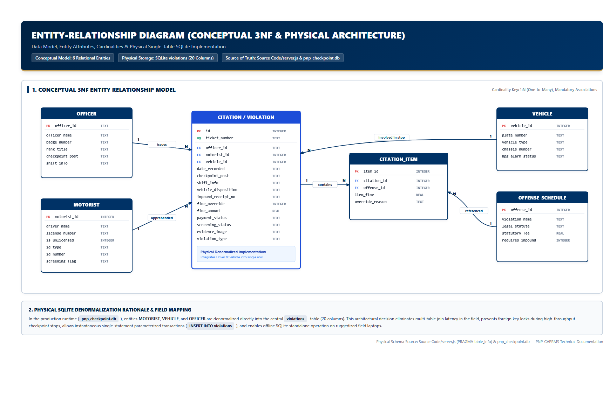
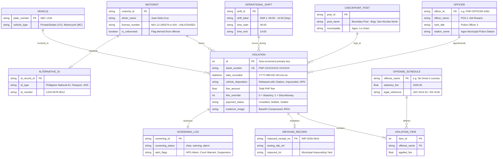
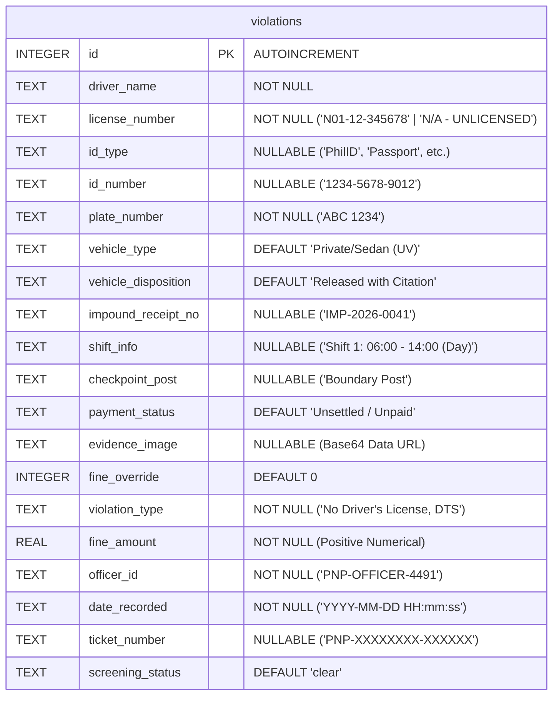

# Entity-Relationship Diagram (ERD)

**System**: PNP Checkpoint Violation Processing & Records Management System (PNP-CVPRMS)  
**Database**: SQLite 3 (`pnp_checkpoint.db`)  
**Single Source of Truth**: [`Source Code/server.js`](file:///c:/Users/emman/PNP-CVPRMS/Source%20Code/server.js) & [`Source Code/index.html`](file:///c:/Users/emman/PNP-CVPRMS/Source%20Code/index.html)

---

## 1. Overview

This document presents both the **Conceptual / Logical Relational Model (3NF)** and the **Physical SQLite Schema Implementation** deployed in PNP-CVPRMS. 

In field checkpoint operations, high query speed, zero-latency table scans, and autonomous offline durability are critical. The physical implementation consolidates operational citations into an optimized, self-contained `violations` table, with in-memory schedules and blacklists governing business constraints.

---

## 2. Conceptual & Logical ERD Visual & Mermaid Representation

---

## 3. Physical SQLite Schema Implementation (`violations`)

In the active production system, the SQLite database (`pnp_checkpoint.db`) implements the following single-table schema:

---

## 4. Entity Cardinality & Relational Semantics

| Parent Entity | Child Entity | Cardinality | Business Semantics & Referential Constraints |
| :--- | :--- | :---: | :--- |
| **`OFFICER`** | **`VIOLATION`** | `1 : N` | One checkpoint officer can record multiple apprehensions during a shift. An apprehension must specify exactly one apprehending officer badge. |
| **`CHECKPOINT_POST`** | **`VIOLATION`** | `1 : N` | One checkpoint location logs multiple daily citation records. |
| **`OPERATIONAL_SHIFT`**| **`VIOLATION`** | `1 : N` | Citations belong to exactly one 8-hour shift bracket (Day, Afternoon, Night). |
| **`MOTORIST`** | **`VIOLATION`** | `1 : N` | A driver may be cited multiple times across different dates. |
| **`MOTORIST`** | **`ALTERNATIVE_ID`** | `1 : 0..1`| An unlicensed driver is associated with exactly one alternative government ID (e.g. National ID, Passport). |
| **`VEHICLE`** | **`VIOLATION`** | `1 : N` | A vehicle plate may be apprehended in multiple distinct checkpoint incidents. |
| **`VIOLATION`** | **`IMPOUND_RECORD`** | `1 : 0..1`| Exactly one impound receipt number is mandated if `vehicle_disposition == 'Impounded'`; omitted otherwise. |
| **`VIOLATION`** | **`VIOLATION_ITEM`** | `1 : 1..N`| A citation must register at least one apprehended infraction from the official offense schedule. |

---

## 5. Denormalization Rationale in SQLite

While the 3NF relational model specifies multiple normalized entities, PNP-CVPRMS intentionally denormalizes these fields into the `violations` table for the following design reasons:
1. **Zero-Latency Offline Checkpoint Operation**: Checkpoints often operate in field environments with intermittent connectivity or on battery-powered mobile terminals. Single-table operations eliminate multi-table JOIN overhead.
2. **Atomic Self-Contained Citations**: Citations serve as legal evidentiary records. Flattening the apprehended driver's name, license number, plate, fine, and officer badge directly into the record ensures that future external roster or schedule changes never retroactively alter past citations.
3. **High-Speed Full-Text Search**: Single-table layout enables fast SQLite multi-column search (`ticket_number`, `license_number`, `plate_number`, `driver_name`, `id_number`, `officer_id`) in a single query pass.
