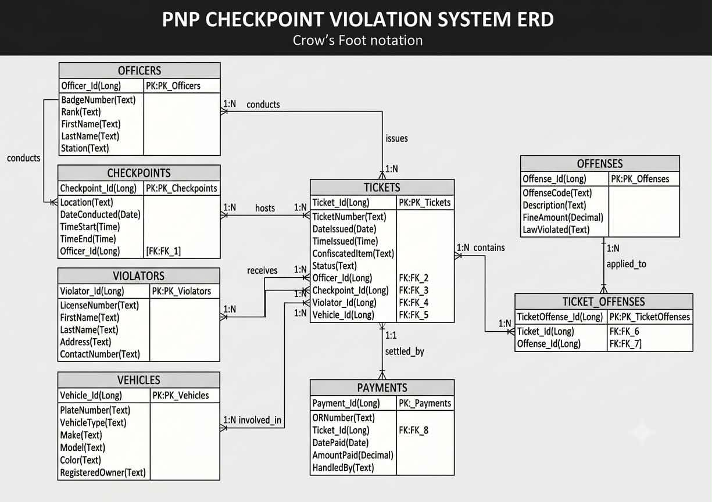

## 📌 Entity Relationship Diagram (ERD)

**Description:**

The Entity Relationship Diagram (ERD) illustrates the logical database structure of the PNP-CVPRMS. It identifies the system entities, their attributes, primary keys, foreign keys, and relationships that support efficient storage and retrieval of checkpoint and violation records.

