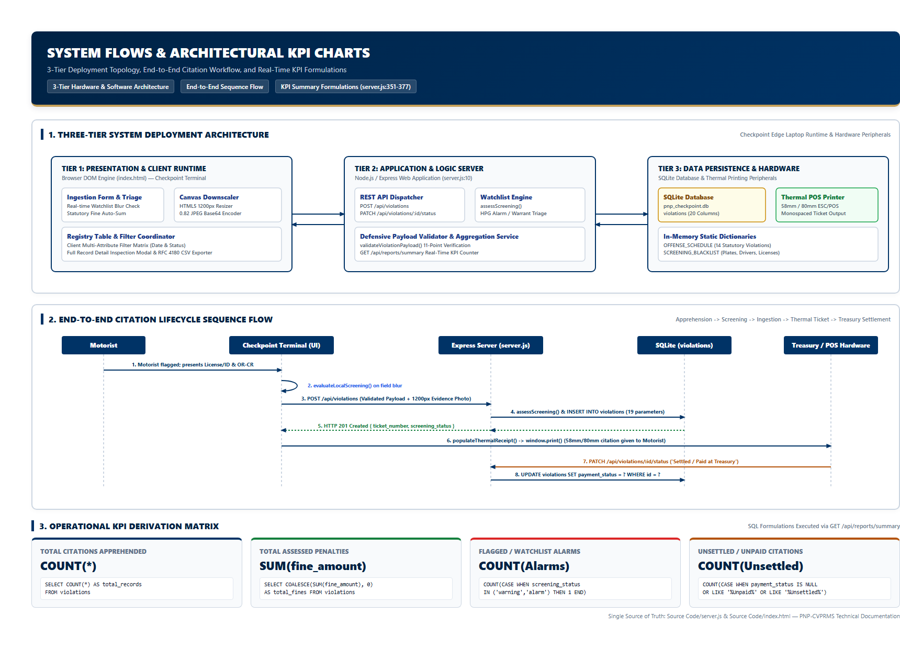
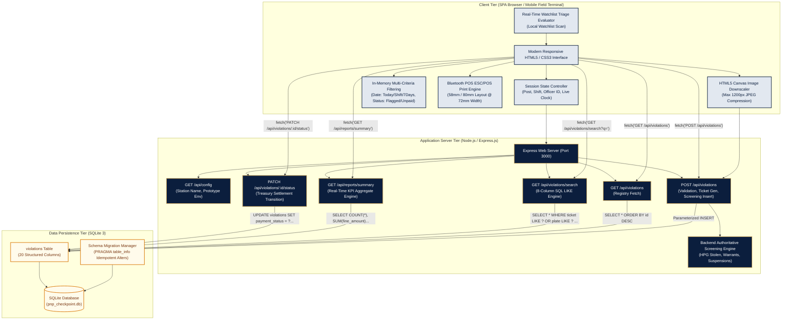
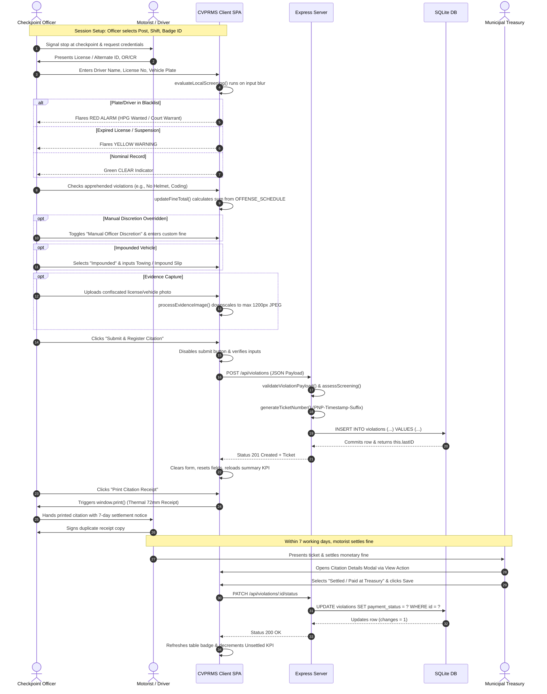
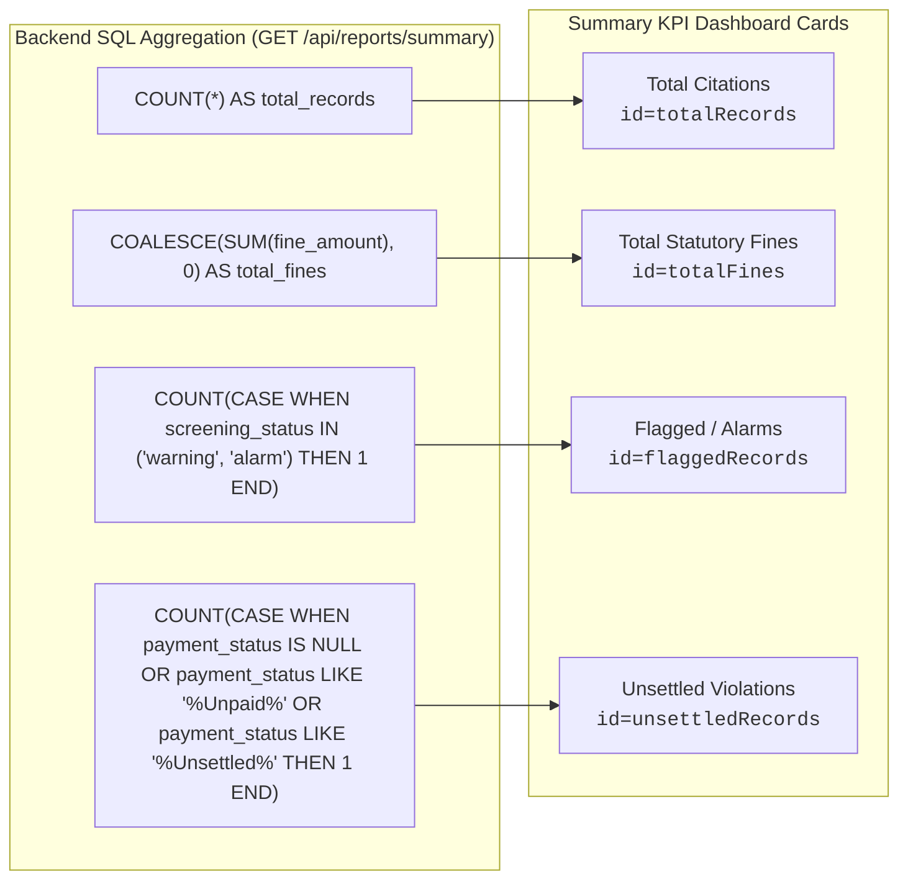
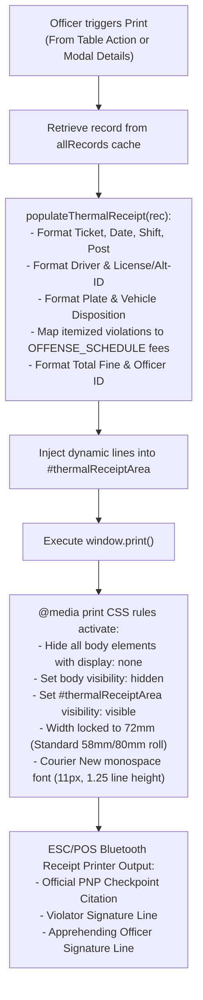

# System Flows, Architectural Graphs & KPI Charts

**System**: PNP Checkpoint Violation Processing & Records Management System (PNP-CVPRMS)  
**Single Source of Truth**: [`Source Code/server.js`](file:///c:/Users/emman/PNP-CVPRMS/Source%20Code/server.js) & [`Source Code/index.html`](file:///c:/Users/emman/PNP-CVPRMS/Source%20Code/index.html)

---

## 1. System Architecture Diagram

---

## 2. Operational Checkpoint Apprehension & Settlement Workflow

---

## 3. Executive KPI Metric Derivation & Logic Formulations

The dashboard presents four real-time Key Performance Indicator (KPI) metrics, computed synchronously via SQL aggregation and reflected in the summary cards:

### 3.1 Mathematical Formulations

1. **Total Citations ($C_{\text{total}}$)**:
   $$C_{\text{total}} = \sum_{i=1}^{N} 1 = \text{COUNT(*)}$$
   *Represents the all-time gross count of registered apprehensions in the database.*

2. **Total Statutory Fines ($F_{\text{total}}$)**:
   $$F_{\text{total}} = \sum_{i=1}^{N} \text{fine\_amount}_i$$
   *Formatted using Philippine currency representation: `₱XX,XXX.00`.*

3. **Flagged Watchlist Ratio ($R_{\text{flagged}}$)**:
   $$R_{\text{flagged}} = \frac{\sum_{i=1}^{N} [\text{screening\_status}_i \in \{\text{'warning'}, \text{'alarm'}\}]}{C_{\text{total}}} \times 100\%$$
   *Indicates the density of high-risk motorists or stolen vehicles intercepted at checkpoints.*

4. **Outstanding Delinquency Rate ($D_{\text{unsettled}}$)**:
   $$D_{\text{unsettled}} = \frac{\sum_{i=1}^{N} [\text{payment\_status}_i \in \{\text{'Unsettled / Unpaid'}\}]}{C_{\text{total}}} \times 100\%$$
   *Monitors non-compliance rate within the statutory 7-working-day treasury settlement window.*

---

## 4. Bluetooth Thermal POS Receipt Print Workflow

