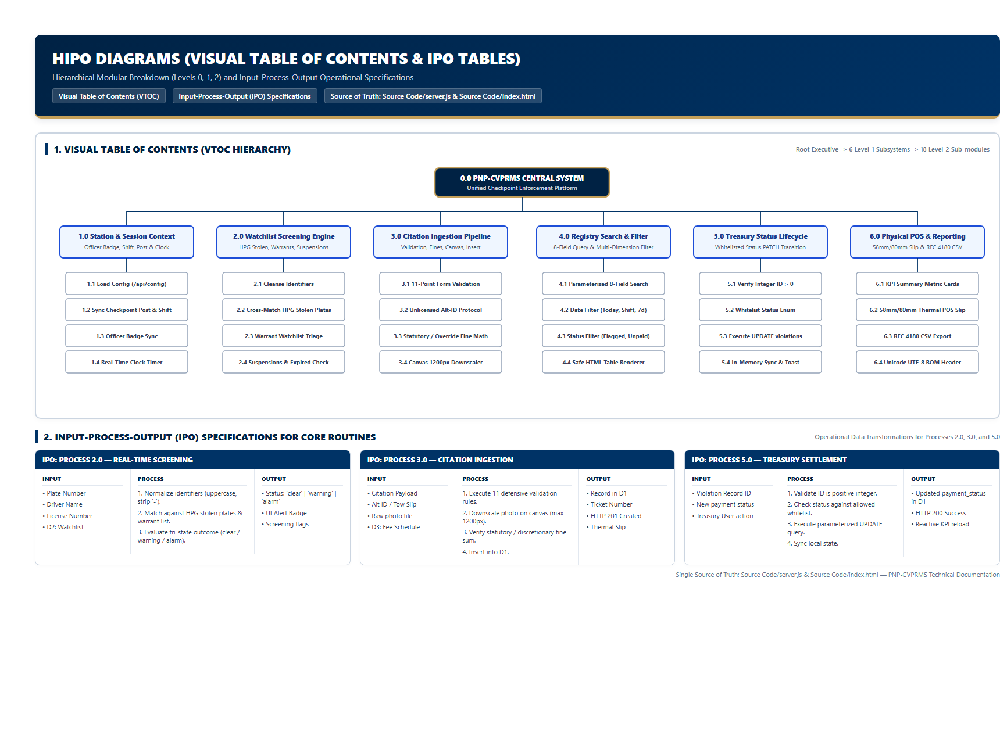

# HIPO Diagrams (Hierarchy plus Input-Process-Output)

**System**: PNP Checkpoint Violation Processing & Records Management System (PNP-CVPRMS)  
**Single Source of Truth**: [`Source Code/server.js`](file:///c:/Users/emman/PNP-CVPRMS/Source%20Code/server.js) & [`Source Code/index.html`](file:///c:/Users/emman/PNP-CVPRMS/Source%20Code/index.html)

---

## 1. Visual Table of Contents (VTOC)

The Visual Table of Contents illustrates the modular breakdown and calling hierarchy of the PNP-CVPRMS application across Level 0, Level 1, and Level 2 subsystems.

```mermaid
graph TD
    %% Level 0
    ROOT["<b>0.0 PNP-CVPRMS Central System</b>"]

    %% Level 1
    M1["<b>1.0 Station & Session Management</b>"]
    M2["<b>2.0 Watchlist Screening Subsystem</b>"]
    M3["<b>3.0 Apprehension & Citation Engine</b>"]
    M4["<b>4.0 Registry Search & Filter Engine</b>"]
    M5["<b>5.0 Treasury Settlement Subsystem</b>"]
    M6["<b>6.0 Reporting & Physical Printing</b>"]

    ROOT --> M1
    ROOT --> M2
    ROOT --> M3
    ROOT --> M4
    ROOT --> M5
    ROOT --> M6

    %% Level 2 - Module 1
    M1_1["1.1 Load Station Config (/api/config)"]
    M1_2["1.2 Sync Checkpoint Post & Shift"]
    M1_3["1.3 Sync / Custom Officer Badge"]
    M1_4["1.4 Real-Time Clock Timer"]
    M1 --> M1_1
    M1 --> M1_2
    M1 --> M1_3
    M1 --> M1_4

    %% Level 2 - Module 2
    M2_1["2.1 Cleanse Plate & Driver Identifiers"]
    M2_2["2.2 Cross-Match HPG Stolen Plates"]
    M2_3["2.3 Cross-Match National Court Warrants"]
    M2_4["2.4 Check Suspensions & Expiration"]
    M2_5["2.5 Update Tri-State Alert Badge"]
    M2 --> M2_1
    M2 --> M2_2
    M2 --> M2_3
    M2 --> M2_4
    M2 --> M2_5

    %% Level 2 - Module 3
    M3_1["3.1 Validate Required Form Fields"]
    M3_2["3.2 Enforce Unlicensed Alt-ID Protocol"]
    M3_3["3.3 Mandate Impound Receipt if Impounded"]
    M3_4["3.4 Compute Statutory / Discretionary Fines"]
    M3_5["3.5 Downscale Attached Photo (Canvas)"]
    M3_6["3.6 Generate Ticket Number Seed"]
    M3_7["3.7 Execute Parameterized SQLite Insert"]
    M3 --> M3_1
    M3 --> M3_2
    M3 --> M3_3
    M3 --> M3_4
    M3 --> M3_5
    M3 --> M3_6
    M3 --> M3_7

    %% Level 2 - Module 4
    M4_1["4.1 Fetch All Records (/api/violations)"]
    M4_2["4.2 Execute 8-Column Search (/api/violations/search)"]
    M4_3["4.3 Apply Multi-Chip Date Filters"]
    M4_4["4.4 Apply Multi-Chip Status Filters"]
    M4_5["4.5 Render Formatted Registry HTML Table"]
    M4 --> M4_1
    M4 --> M4_2
    M4 --> M4_3
    M4 --> M4_4
    M4 --> M4_5

    %% Level 2 - Module 5
    M5_1["5.1 Open Citation Inspection Modal"]
    M5_2["5.2 Verify Status Transition Whitelist"]
    M5_3["5.3 Dispatch PATCH /api/violations/:id/status"]
    M5_4["5.4 Commit DB Change & Update Cache"]
    M5 --> M5_1
    M5 --> M5_2
    M5 --> M5_3
    M5 --> M5_4

    %% Level 2 - Module 6
    M6_1["6.1 Compute Live Aggregates (/api/reports/summary)"]
    M6_2["6.2 Populate 72mm ESC/POS Receipt Model"]
    M6_3["6.3 Trigger window.print() CSS Thermal Media"]
    M6_4["6.4 Export Excel UTF-8 BOM CSV File"]
    M6 --> M6_1
    M6 --> M6_2
    M6 --> M6_3
    M6 --> M6_4

    %% Styling
    classDef root fill:#0B1E3D,stroke:#C5A059,stroke-width:3px,color:#ffffff;
    classDef l1 fill:#152C53,stroke:#CBD5E1,stroke-width:2px,color:#ffffff;
    classDef l2 fill:#F8FAFC,stroke:#475569,stroke-width:1px,color:#0F172A;
    class ROOT root;
    class M1,M2,M3,M4,M5,M6 l1;
    class M1_1,M1_2,M1_3,M1_4,M2_1,M2_2,M2_3,M2_4,M2_5,M3_1,M3_2,M3_3,M3_4,M3_5,M3_6,M3_7,M4_1,M4_2,M4_3,M4_4,M4_5,M5_1,M5_2,M5_3,M5_4,M6_1,M6_2,M6_3,M6_4 l2;
```

---

## 2. Input-Process-Output (IPO) Tables

### IPO-1.0: Station & Session Management

| Input | Process | Output |
| :--- | :--- | :--- |
| • Server environment `process.env.STATION_NAME` • User dropdown inputs: `#sessionPost`, `#sessionShift`, `#sessionOfficer` • Browser local system clock | 1. Fetch `/api/config` and populate header branding. 2. Bind change listeners to update session parameters. 3. Parse badge ID from selected officer string or prompt for custom badge. 4. Execute `setInterval` 1000ms timer to display formatted local time. | • `#stationNameDisplay` updated. • Form inputs (`#officer_id`) synchronized. • Live operational session context maintained for subsequent citations. |

---

### IPO-2.0: Watchlist Screening Subsystem

| Input | Process | Output |
| :--- | :--- | :--- |
| • Vehicle Plate (`#plate_number`) • Driver Full Name (`#driver_name`) • License Number (`#license_number`) • Constant `SCREENING_BLACKLIST` | 1. Strip whitespace/hyphens from plate; convert driver name & license to uppercase. 2. Match plate against `plate_numbers` (HPG Alarms). 3. Match driver against `drivers` (Court Warrants). 4. Match license against `license_numbers` or scan for `"EXPIRED"`. 5. Formulate triage status: `'alarm'`, `'warning'`, or `'clear'`. | • `#screeningStatusBadge` updated with style (`status-clear`, `status-warning`, `status-alarm`). • Diagnostic alert text displayed in `#screeningStatusText`. • Screening metadata persisted in database record. |

---

### IPO-3.0: Apprehension & Citation Engine

| Input | Process | Output |
| :--- | :--- | :--- |
| • Driver Name, License No. • Alternative ID Type & Number • Plate No, Vehicle Classification • Disposition (`Released`, `Impounded`, `HPG`) • Impound Receipt No. • Checkbox selections in `#violationChecklist` • Fine Amount & Discretionary Toggle • Attached photo file (optional) • Session Post, Shift, Officer ID | 1. Validate mandatory fields (driver name, plate, violations, officer). 2. If unlicensed, enforce alternative ID fields and license value `"N/A - Unlicensed"`. 3. If impounded, enforce impound receipt presence. 4. If fine override is active, accept positive fine; otherwise verify match against `OFFENSE_SCHEDULE`. 5. Downscale photo via Canvas to max 1200px JPEG. 6. Generate `PNP-${Date.now().slice(-8)}-${Suffix}` ticket number. 7. Execute SQLite parameterized INSERT. | • New row created in `violations` table. • HTTP 201 response with `ticket_number` and `recordId`. • Success notification displayed via `showAlert()`. • Form fields reset and post-submission cleanup triggered. |

---

### IPO-4.0: Registry Search & Multi-Dimensional Filter Engine

| Input | Process | Output |
| :--- | :--- | :--- |
| • Search bar query string (`#searchInput`) • Date filter chips (`all`, `today`, `shift`, `7days`) • Status filter chips (`all`, `flagged`, `unpaid`) • `allRecords[]` cached array | 1. If search query present, invoke `GET /api/violations/search?q=`, else `GET /api/violations`. 2. Filter array against active date chip (validate date timestamps). 3. Filter array against active status chip (flagged alarms vs unpaid delinquency). 4. Iterate over `visibleRecords[]` and construct sanitized HTML rows with pill badges and action buttons. | • DOM `#violationsTableBody` populated. • Record count displayed. • View and Print buttons bound to specific record IDs. |

---

### IPO-5.0: Citation Settlement & Treasury Subsystem

| Input | Process | Output |
| :--- | :--- | :--- |
| • Target Record ID (`currentModalRecordId`) • Selected status from `#mStatusSelect` • Whitelist: `['Unsettled / Unpaid', 'Settled / Paid at Treasury', 'Voided / Contested']` | 1. Validate numeric record ID on server. 2. Validate status string against whitelist. 3. Execute SQL `UPDATE violations SET payment_status = ? WHERE id = ?`. 4. On success (changes > 0), update local record cache and refresh summary metrics. 5. If error occurs, display alert notice without losing user context. | • SQLite `payment_status` updated. • Table badge class updated (`payment-paid`, `payment-void`, `payment-unpaid`). • KPI "Unsettled Violations" card decremented. |

---

### IPO-6.0: Reporting & Physical Printing

| Input | Process | Output |
| :--- | :--- | :--- |
| • Selected record object (`rec`) • `OFFENSE_SCHEDULE` fee map • Current `visibleRecords[]` dataset • Summary aggregates from SQLite | 1. **Print**: Hydrate `#thermalReceiptArea` with ticket number, date, driver, plate, itemized fees, signature lines. Execute `window.print()`. CSS `@media print` renders 72mm thermal paper output. 2. **CSV Export**: Extract all 17 schema columns, escape embedded quotes (`""`), prepend UTF-8 BOM (`\uFEFF`), construct blob, trigger download, and revoke URL. 3. **KPI Summary**: Compute SQL aggregates and format PHP currency strings. | • 58mm/80mm Bluetooth thermal physical printout. • Downloaded `.csv` file formatted for Microsoft Excel. • Real-time summary metric cards updated on dashboard. |
