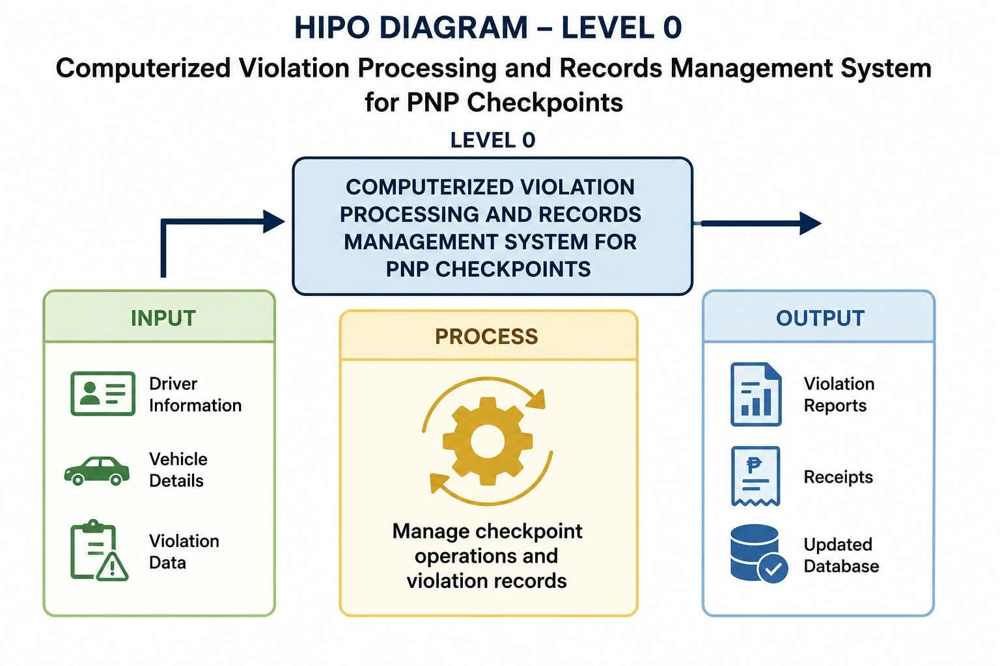
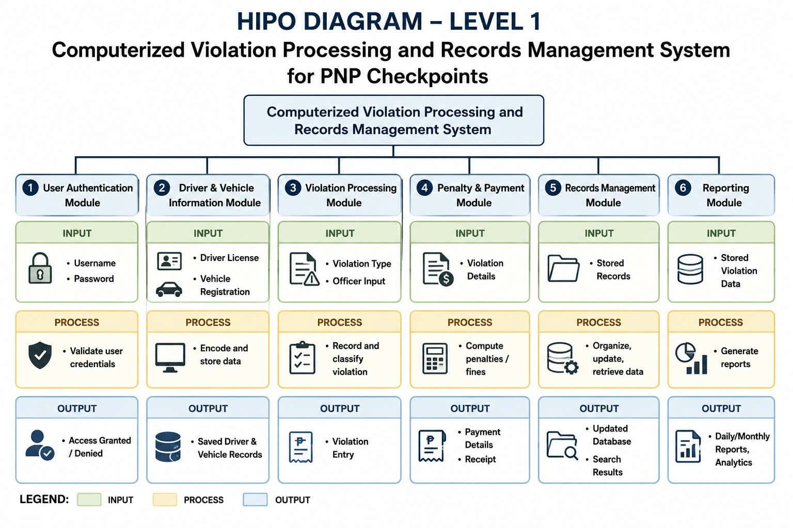
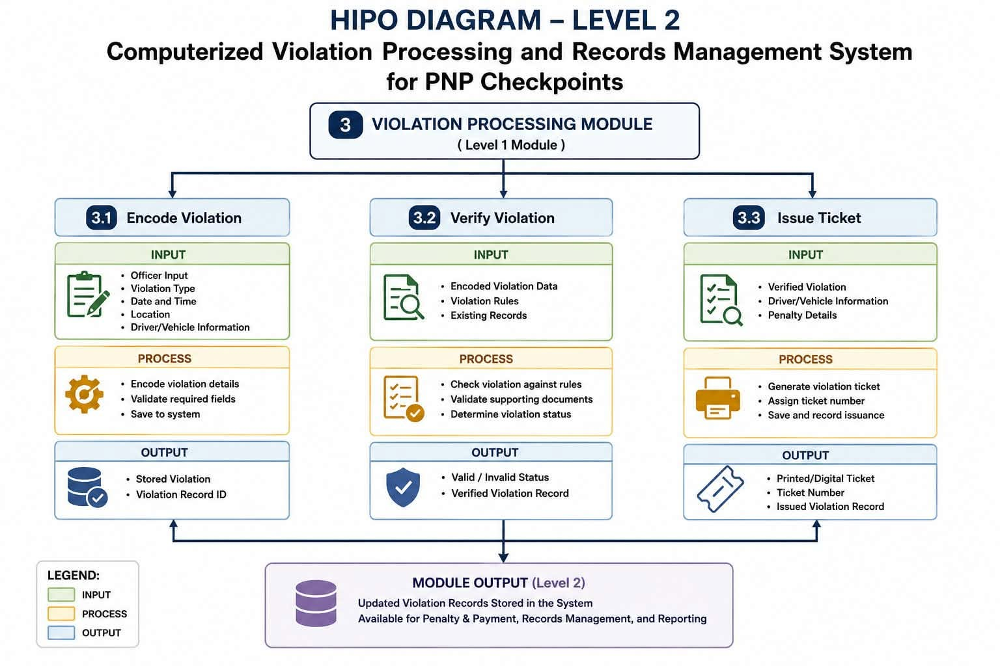

# 📌 HIPO (Hierarchy plus Input-Process-Output) Diagram

## Description

The HIPO Diagram provides a structured representation of every major system module by identifying its required inputs, internal processing, and expected outputs. It serves as a guide for understanding the responsibilities of each component of the PNP-CVPRMS.

---

## HIPO Diagram 0 – System Overview

**Description:**

This diagram illustrates the overall hierarchy of the PNP-CVPRMS, showing the relationship between the main module and its major functional components.

---

## HIPO Diagram 1 – Violation Processing Module

**Description:**

This diagram presents the Input, Process, and Output of the Violation Processing module. It describes how driver and vehicle information is validated, how violations are processed, and how citation records are generated.

---

## HIPO Diagram 2 – Records Management Module

**Description:**

This diagram illustrates the Input, Process, and Output of the Records Management module. It explains how violation records are stored, updated, and retrieved for reporting and monitoring purposes.

