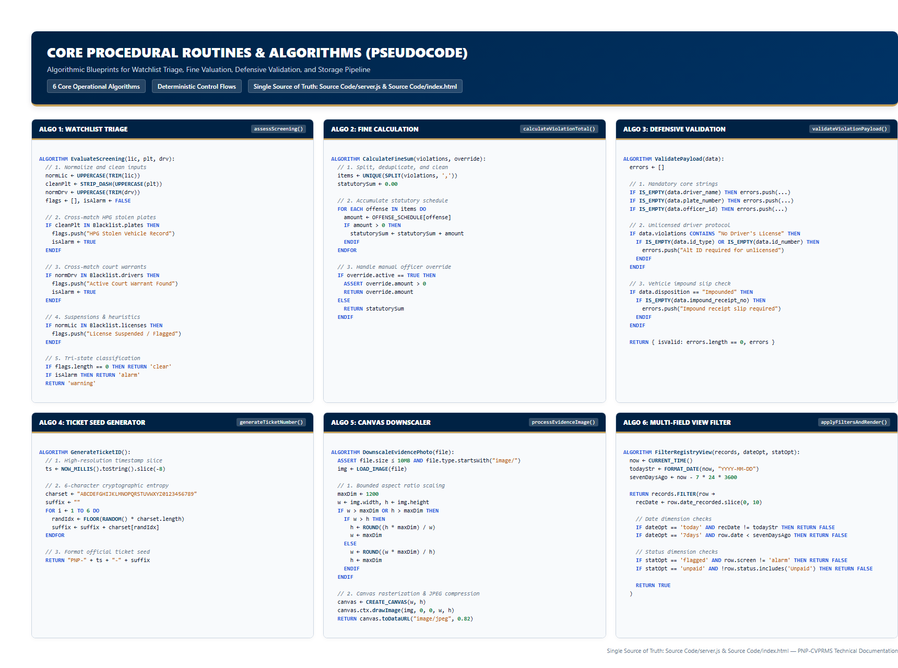

# Core Routines Pseudocode

**System**: PNP Checkpoint Violation Processing & Records Management System (PNP-CVPRMS)  
**Single Source of Truth**: [`Source Code/server.js`](file:///c:/Users/emman/PNP-CVPRMS/Source%20Code/server.js) & [`Source Code/index.html`](file:///c:/Users/emman/PNP-CVPRMS/Source%20Code/index.html)



---

## 1. Algorithm 1: Violations Normalization & Statutory Fine Calculation

**Source**: [`server.js:37-60`](file:///c:/Users/emman/PNP-CVPRMS/Source%20Code/server.js#L37-L60) & [`index.html:1480-1486`](file:///c:/Users/emman/PNP-CVPRMS/Source%20Code/index.html#L1480-L1486)

```text
ALGORITHM normalizeViolations(input)
    INPUT: input (Array of strings OR comma-delimited string)
    OUTPUT: Array of unique, trimmed violation name strings

    IF input IS Array THEN
        SET list = []
        FOR EACH item IN input DO
            SET cleaned = TRIM(TO_STRING(item))
            IF cleaned != "" THEN
                APPEND cleaned TO list
            END IF
        END FOR
        RETURN DEDUPLICATE(list)
    ELSE IF input IS String THEN
        SET tokens = SPLIT(input, ",")
        SET list = []
        FOR EACH item IN tokens DO
            SET cleaned = TRIM(item)
            IF cleaned != "" THEN
                APPEND cleaned TO list
            END IF
        END FOR
        RETURN DEDUPLICATE(list)
    ELSE
        RETURN []
    END IF
END ALGORITHM

ALGORITHM calculateViolationTotal(violations)
    INPUT: violations (Array or String)
    OUTPUT: totalAmount (Float)

    SET normalizedList = normalizeViolations(violations)
    SET total = 0.0

    FOR EACH violationName IN normalizedList DO
        IF violationName EXISTS IN OFFENSE_SCHEDULE THEN
            SET fee = TO_NUMBER(OFFENSE_SCHEDULE[violationName])
            IF IS_FINITE(fee) THEN
                SET total = total + fee
            END IF
        END IF
    END FOR

    RETURN total
END ALGORITHM
```

---

## 2. Algorithm 2: Watchlist & HPG Alarm Triage Screening

**Source**: [`server.js:82-117`](file:///c:/Users/emman/PNP-CVPRMS/Source%20Code/server.js#L82-L117) & [`index.html:1503-1520`](file:///c:/Users/emman/PNP-CVPRMS/Source%20Code/index.html#L1503-L1520)

```text
ALGORITHM assessScreening(licenseNumber, plateNumber, driverName)
    INPUT: licenseNumber (String), plateNumber (String), driverName (String)
    OUTPUT: Object { status, status_label, flags }

    SET flags = []
    SET isAlarm = FALSE

    SET normLicense = UPPERCASE(TRIM(TO_STRING(licenseNumber)))
    SET normPlate = UPPERCASE(TRIM(TO_STRING(plateNumber)))
    SET normDriver = UPPERCASE(TRIM(TO_STRING(driverName)))

    // Normalize Plate: Strip hyphens and spaces
    SET cleanPlate = REPLACE_ALL(normPlate, ["-", " "], "")
    SET blacklistPlates = MAP(SCREENING_BLACKLIST.plate_numbers, p => REPLACE_ALL(UPPERCASE(p), ["-", " "], ""))

    IF cleanPlate != "" AND cleanPlate IN blacklistPlates THEN
        APPEND "Vehicle plate matches an active HPG Alarm / Stolen Vehicle record." TO flags
        SET isAlarm = TRUE
    END IF

    // Normalize Driver: Case-insensitive watchlist search
    SET blacklistDrivers = MAP(SCREENING_BLACKLIST.drivers, d => UPPERCASE(d))
    IF normDriver != "" AND normDriver IN blacklistDrivers THEN
        APPEND "Driver matches an active National Police Watchlist / Court Warrant." TO flags
        SET isAlarm = TRUE
    END IF

    // Normalize License: Check suspension list
    SET cleanLicense = REPLACE_ALL(normLicense, ["-", " "], "")
    SET blacklistLicenses = MAP(SCREENING_BLACKLIST.license_numbers, l => REPLACE_ALL(UPPERCASE(l), ["-", " "], ""))
    IF cleanLicense != "" AND NOT (normLicense CONTAINS "UNLICENSED") THEN
        IF cleanLicense IN blacklistLicenses THEN
            APPEND "License record matches a flagged suspension or repeat offender record." TO flags
        END IF
    END IF

    // Scan Expired Status keywords
    IF LENGTH(flags) == 0 THEN
        IF (NOT (normLicense CONTAINS "UNLICENSED") AND (normLicense CONTAINS "EXPIRED")) OR (normPlate CONTAINS "EXPIRED") THEN
            APPEND "License or plate indicates expired status requiring verification." TO flags
        END IF
    END IF

    // Formulate Tri-State Result
    IF LENGTH(flags) == 0 THEN
        RETURN { status: "clear", status_label: "CLEAR", flags: ["No screening alerts found in local rule set."] }
    ELSE IF isAlarm == TRUE THEN
        RETURN { status: "alarm", status_label: "ALARM / HPG WANTED", flags: flags }
    ELSE
        RETURN { status: "warning", status_label: "WARNING / REPEAT OFFENDER", flags: flags }
    END IF
END ALGORITHM
```

---

## 3. Algorithm 3: Comprehensive Apprehension Validation Engine

**Source**: [`server.js:232-296`](file:///c:/Users/emman/PNP-CVPRMS/Source%20Code/server.js#L232-L296)

```text
ALGORITHM validateViolationPayload(data)
    INPUT: data (Object representing apprehension submission)
    OUTPUT: Object { isValid: Boolean, errors: Array of Strings }

    SET errors = []

    // 1. Driver Name Verification
    IF data.driver_name IS NULL OR TRIM(data.driver_name) == "" THEN
        APPEND "Driver name is required and cannot be empty." TO errors
    END IF

    // 2. Unlicensed vs Licensed Identity Verification
    SET violationList = normalizeViolations(data.violation_type OR data.violation_types)
    SET isUnlicensed = "No Driver's License" IN violationList

    IF isUnlicensed == TRUE THEN
        IF data.license_number IS NULL OR UPPERCASE(TRIM(data.license_number)) != "N/A - UNLICENSED" THEN
            APPEND "Driver license number must be set to 'N/A - Unlicensed' when 'No Driver's License' is selected." TO errors
        END IF
        IF data.id_type IS NULL OR TRIM(data.id_type) == "" THEN
            APPEND "Alternative ID type is required for unlicensed drivers." TO errors
        END IF
        IF data.id_number IS NULL OR TRIM(data.id_number) == "" THEN
            APPEND "Alternative ID number is required for unlicensed drivers." TO errors
        END IF
    ELSE
        IF data.license_number IS NULL OR TRIM(data.license_number) == "" THEN
            APPEND "Driver license number is required." TO errors
        ELSE IF UPPERCASE(TRIM(data.license_number)) == "N/A - UNLICENSED" THEN
            APPEND "Driver license number cannot be 'N/A - Unlicensed' unless 'No Driver's License' violation is selected." TO errors
        END IF
    END IF

    // 3. Vehicle Plate Verification
    IF data.plate_number IS NULL OR TRIM(data.plate_number) == "" THEN
        APPEND "Vehicle plate number is required." TO errors
    END IF

    // 4. Violation Selection Count
    IF LENGTH(violationList) == 0 THEN
        APPEND "At least one violation type is required." TO errors
    END IF

    // 5. Officer Identifier Verification
    IF data.officer_id IS NULL OR TRIM(data.officer_id) == "" THEN
        APPEND "Apprehending Officer ID/Badge is required." TO errors
    END IF

    // 6. Fine Numerical Boundaries & Override Tolerance
    SET fine = TO_NUMBER(data.fine_amount)
    IF NOT IS_FINITE(fine) OR fine <= 0 THEN
        APPEND "Fine amount must be a positive numerical value." TO errors
    END IF

    SET isFineOverride = (data.fine_override == 1 OR data.fine_override == "1" OR data.fine_override == TRUE OR data.fine_override == "true")
    IF isFineOverride == FALSE THEN
        SET totalExpected = calculateViolationTotal(violationList)
        IF IS_FINITE(fine) AND ABS(fine - totalExpected) > 0.05 THEN
            APPEND "Matching fine total required for selected violations: ₱" + FORMAT_CURRENCY(totalExpected) TO errors
        END IF
    END IF

    // 7. Impoundment Receipt Mandate
    IF data.vehicle_disposition == "Impounded" THEN
        IF data.impound_receipt_no IS NULL OR TRIM(data.impound_receipt_no) == "" THEN
            APPEND "Impound Receipt / Towing Slip Number is required when vehicle disposition is Impounded." TO errors
        END IF
    END IF

    RETURN {
        isValid: (LENGTH(errors) == 0),
        errors: errors
    }
END ALGORITHM
```

---

## 4. Algorithm 4: Cryptographic / Timestamp Seeded Ticket Generator

**Source**: [`server.js:62-69`](file:///c:/Users/emman/PNP-CVPRMS/Source%20Code/server.js#L62-L69)

```text
ALGORITHM generateTicketNumber()
    OUTPUT: ticketNumber (String formatted as PNP-XXXXXXXX-XXXXXX)

    SET timeStamp = SUBSTRING(TO_STRING(CURRENT_TIME_MILLIS()), -8)
    SET charset = "ABCDEFGHIJKLMNOPQRSTUVWXYZ0123456789"
    SET suffix = ""

    FOR i FROM 1 TO 6 DO
        SET randIndex = FLOOR(RANDOM() * LENGTH(charset))
        SET suffix = suffix + charset[randIndex]
    END FOR

    RETURN "PNP-" + timeStamp + "-" + suffix
END ALGORITHM
```

---

## 5. Algorithm 5: Client-Side Canvas Image Downscaler

**Source**: [`index.html:1540-1571`](file:///c:/Users/emman/PNP-CVPRMS/Source%20Code/index.html#L1540-L1571)

```text
ALGORITHM processEvidenceImage(file, callback)
    INPUT: file (File object from file input), callback (Function)

    SET reader = NEW FileReader()
    reader.onload = FUNCTION (event)
        SET img = NEW Image()
        img.onload = FUNCTION ()
            SET maxDim = 1200
            SET w = img.width
            SET h = img.height

            IF w > maxDim OR h > maxDim THEN
                IF w > h THEN
                    SET h = ROUND((h * maxDim) / w)
                    SET w = maxDim
                ELSE
                    SET w = ROUND((w * maxDim) / h)
                    SET h = maxDim
                END IF
            END IF

            SET canvas = CREATE_ELEMENT("canvas")
            canvas.width = w
            canvas.height = h
            SET ctx = canvas.getContext("2d")
            ctx.drawImage(img, 0, 0, w, h)

            // Compress to JPEG with 82% quality factor
            SET compressedDataUrl = canvas.toDataURL("image/jpeg", 0.82)
            EXECUTE callback(compressedDataUrl)
        END FUNCTION

        img.onerror = FUNCTION ()
            SHOW_ALERT("Selected file could not be parsed as an image.", "danger")
            EXECUTE callback(NULL)
        END FUNCTION

        img.src = event.target.result
    END FUNCTION

    reader.onerror = FUNCTION ()
        SHOW_ALERT("Failed to read image file.", "danger")
        EXECUTE callback(NULL)
    END FUNCTION

    reader.readAsDataURL(file)
END ALGORITHM
```

---

## 6. Algorithm 6: Multi-Dimensional Registry Filter & Table Render

**Source**: [`index.html:1826-1886`](file:///c:/Users/emman/PNP-CVPRMS/Source%20Code/index.html#L1826-L1886)

```text
ALGORITHM applyFiltersAndRender()
    GLOBAL: allRecords, activeDateFilter, activeStatusFilter, sessionShift

    SET now = CURRENT_DATE()
    SET todayStr = FORMAT_DATE(now, "YYYY-MM-DD")
    SET sevenDaysAgo = now - (7 * 24 * 60 * 60 * 1000)

    SET visibleRecords = FILTER(allRecords, FUNCTION(record)
        SET recordDateStr = SUBSTRING(record.date_recorded, 0, 10)
        SET recordDate = PARSE_DATE(REPLACE(record.date_recorded, " ", "T"))
        SET isDateValid = NOT IS_NAN(recordDate)

        // Evaluate Date Filter
        IF activeDateFilter == "today" AND recordDateStr != todayStr THEN
            RETURN FALSE
        END IF
        IF activeDateFilter == "7days" AND (NOT isDateValid OR recordDate < sevenDaysAgo) THEN
            RETURN FALSE
        END IF
        IF activeDateFilter == "shift" AND (recordDateStr != todayStr OR record.shift_info != sessionShift.value) THEN
            RETURN FALSE
        END IF

        // Evaluate Status Filter
        SET isFlagged = record.screening_status IN ["alarm", "warning", "ALARM / HPG WANTED", "WARNING / REPEAT OFFENDER"]
        IF activeStatusFilter == "flagged" AND isFlagged == FALSE THEN
            RETURN FALSE
        END IF

        SET isUnpaid = (record.payment_status IS NULL OR record.payment_status CONTAINS "Unpaid" OR record.payment_status CONTAINS "Unsettled")
        IF activeStatusFilter == "unpaid" AND isUnpaid == FALSE THEN
            RETURN FALSE
        END IF

        RETURN TRUE
    END FUNCTION)

    RENDER_TABLE(visibleRecords)
END ALGORITHM
```
