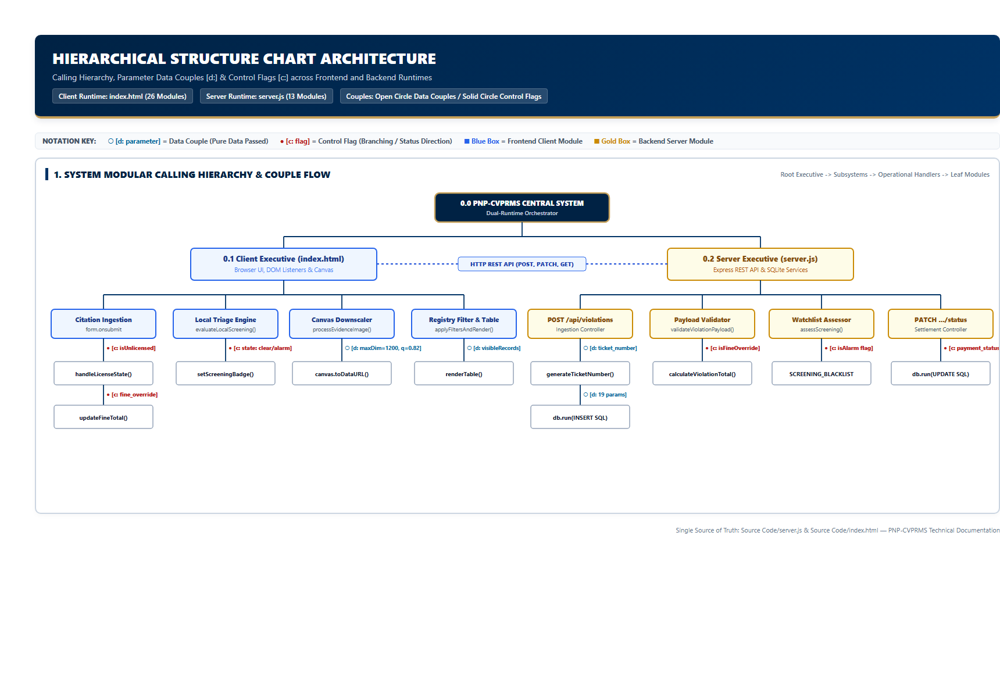
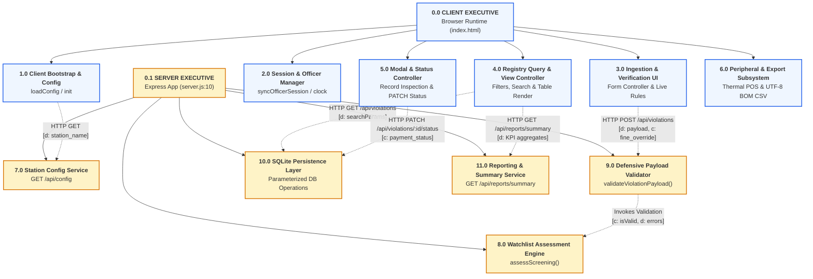
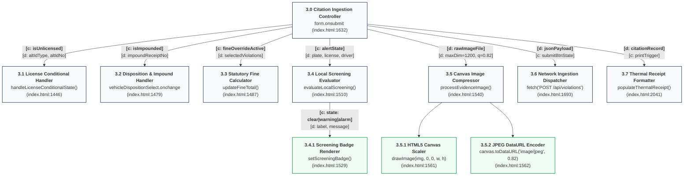
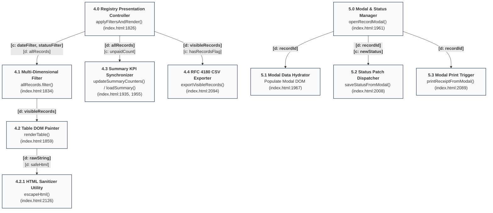
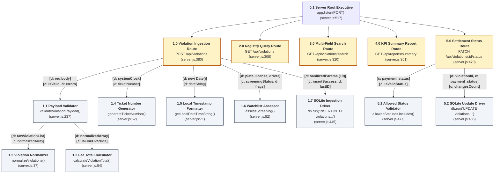

# Structure Chart Architecture

**System**: PNP Checkpoint Violation Processing & Records Management System (PNP-CVPRMS)  
**Single Source of Truth**: [`Source Code/server.js`](file:///c:/Users/emman/PNP-CVPRMS/Source%20Code/server.js) & [`Source Code/index.html`](file:///c:/Users/emman/PNP-CVPRMS/Source%20Code/index.html)  
**Database**: SQLite (`pnp_checkpoint.db`) — Table: `violations`  

---

## 1. Architectural Overview & Notational Legend

A Structure Chart models the top-down modular decomposition of a software system, delineating the calling hierarchy, the boundaries between modules, and the flow of data couples and control flags across system boundaries.

### 1.1 Coupling & Flag Notation Guide
In the diagrams and module catalogs below, data flow and control flags are represented using standard software engineering notations:

* **Data Couple `[d: parameter]` (Open Circle $\circ\rightarrow$)**: An item of application data passed between calling and called modules without altering execution path logic.
* **Control Flag `[c: flag]` (Solid Circle $\bullet\rightarrow$)**: A binary, enum, or signal flag passed between modules specifically to direct execution branching, indicate error conditions, or signal status.
* **Selection Diamond `◇`**: Conditional invocation of a subordinate module based on the state of a control flag.
* **Repetition Arc `↻`**: Iterative or looped invocation of subordinate modules over collections or event streams.

```
       +----------------------------+
       |       CALLING MODULE       |
       +----------------------------+
                 |        |
    [d: dataIn]  |        |  [c: flagOut]
   (Open Circle) v        ^ (Solid Circle)
       +----------------------------+
       |     SUBORDINATE MODULE     |
       +----------------------------+
```

---

## 2. High-Level Modular Decomposition (Root Executive)



The diagram below maps the dual-runtime architecture of PNP-CVPRMS: the **Client Browser Executive** (`index.html`) running on the checkpoint terminal and the **Backend Server Executive** (`server.js`) running in Node.js.



---

## 3. Client-Side Structure Chart (`Source Code/index.html`)

The frontend application coordinates user interactions, real-time field masking, client-side watchlist triage, statutory fee computations, photographic canvas downscaling, table rendering, and thermal printing.



### 3.1 Client Registry, Search, and Status Transition Hierarchy



---

## 4. Backend Server Structure Chart (`Source Code/server.js`)

The Node.js/Express backend handles validation, watchlist screening, SQLite transactions, KPI aggregation, and error handling.



---

## 5. Detailed Module Interface Catalog & Coupling/Cohesion Matrix

The table below catalogs every function, handler, and routine implemented across both [`Source Code/server.js`](file:///c:/Users/emman/PNP-CVPRMS/Source%20Code/server.js) and [`Source Code/index.html`](file:///c:/Users/emman/PNP-CVPRMS/Source%20Code/index.html).

### 5.1 Backend Server Modules (`server.js`)

| Module Identifier | Function / Route Name | Source Location | Cohesion Classification | Coupling Classification | Input Parameters (Data Couples) | Control Flags Handled | Return Values / Output | Callers | Callees |
| :--- | :--- | :--- | :--- | :--- | :--- | :--- | :--- | :--- | :--- |
| **S-MOD-01** | `normalizeViolations` | `server.js:37-52` | **Functional** (transforms input to unique trimmed array) | **Data Coupling** | `input` (Array or CSV String) | None | `Array<string>` (Deduplicated violation names) | `calculateViolationTotal`, `validateViolationPayload`, `POST /api/violations` | `Array.prototype.map`, `filter` |
| **S-MOD-02** | `calculateViolationTotal` | `server.js:54-60` | **Functional** (computes arithmetic sum of offense fees) | **Data Coupling** | `violations` (Array or String) | None | `number` (Total fine amount in PHP) | `validateViolationPayload` | `normalizeViolations`, `OFFENSE_SCHEDULE` |
| **S-MOD-03** | `generateTicketNumber` | `server.js:62-69` | **Functional** (generates standardized ticket identifier) | **Data Coupling** | None | None | `string` (`PNP-<timestamp>-<6-char-random>`) | `POST /api/violations` | `Date.now()`, `Math.random()` |
| **S-MOD-04** | `getLocalDateTimeString` | `server.js:71-80` | **Functional** (formats date to standard SQL string) | **Data Coupling** | `d` (Date instance, optional) | None | `string` (`YYYY-MM-DD HH:mm:ss`) | `POST /api/violations` | `Date` get methods |
| **S-MOD-05** | `assessScreening` | `server.js:82-122` | **Functional** (triages identifiers against watchlist) | **Data & Control Coupling** | `{ licenseNumber, plateNumber, driverName }` | `isAlarm` (Control flag for arrest priority) | `{ status: 'clear'\|'warning'\|'alarm', status_label, flags: [] }` | `POST /api/violations` | `SCREENING_BLACKLIST` |
| **S-MOD-06** | `initializeSchema` | `server.js:158-232` | **Sequential** (creates table, inspects PRAGMA, migrates) | **Stamp Coupling** | None | `pending.length === 0` | None (SQLite table verified) | SQLite Database open callback | `db.run`, `db.all`, `db.serialize` |
| **S-MOD-07** | `validateViolationPayload` | `server.js:237-301` | **Functional** (executes 11 defensive validation rules) | **Control Coupling** | `data` (JSON body) | `isUnlicensed`, `isFineOverride`, `isValid` | `{ isValid: boolean, errors: string[] }` | `POST /api/violations` | `normalizeViolations`, `calculateViolationTotal` |
| **S-MOD-08** | `GET /api/config` | `server.js:135-143` | **Functional** (returns operational station metadata) | **Data Coupling** | `req`, `res` | `success: true` | JSON response with `station_name` | Express Router | None |
| **S-MOD-09** | `GET /api/violations` | `server.js:308-317` | **Functional** (retrieves all records descending) | **Data Coupling** | `req`, `res` | DB Error flag | JSON response with records array | Express Router | `db.all('SELECT * FROM violations...')` |
| **S-MOD-10** | `GET /api/violations/search` | `server.js:320-349` | **Functional** (parameterized 8-field wildcard search) | **Data Coupling** | `req.query.q` | Parameter validation flag | JSON response with matched records | Express Router | `db.all(sql, searchParams)` |
| **S-MOD-11** | `GET /api/reports/summary` | `server.js:351-377` | **Functional** (computes aggregate KPI metrics) | **Data Coupling** | `req`, `res` | DB Error flag | JSON response with `{ total_records, total_fines, flagged_records, unsettled_records }` | Express Router | `db.get(sql)` |
| **S-MOD-12** | `POST /api/violations` | `server.js:380-467` | **Sequential / Communicational** (validates, screens, inserts) | **Control Coupling** | `req.body` | `validation.isValid`, `isAlarm`, `err` | HTTP 201 JSON `{ success, recordId, ticket_number, screening_status }` or 422/500 | Express Router | `validateViolationPayload`, `assessScreening`, `db.run` |
| **S-MOD-13** | `PATCH /api/violations/:id/status` | `server.js:470-500` | **Functional** (whitelisted status mutation) | **Control Coupling** | `req.params.id`, `req.body.payment_status` | Status validity flag, `this.changes === 0` | HTTP 200 JSON `{ success, updatedStatus }` or 400/404/500 | Express Router | `db.run('UPDATE violations SET payment_status = ?')` |

---

### 5.2 Client Frontend Modules (`index.html`)

| Module Identifier | Function / Handler Name | Source Location | Cohesion Classification | Coupling Classification | Input Parameters (Data Couples) | Control Flags Handled | Return Values / Output | Callers | Callees |
| :--- | :--- | :--- | :--- | :--- | :--- | :--- | :--- | :--- | :--- |
| **C-MOD-01** | `formatPHP` | `index.html:1355-1361` | **Functional** (formats numbers to `₱XX,XXX.00`) | **Data Coupling** | `amount` (Number or String) | None | `string` formatted currency | Table painter, modal hydrator, receipt formatter | `Number.toLocaleString` |
| **C-MOD-02** | `getLocalDateTimeString` | `index.html:1364-1373` | **Functional** (formats client clock to ISO format) | **Data Coupling** | `d` (Date instance, optional) | None | `string` (`YYYY-MM-DD HH:mm:ss`) | Form submission fallback, receipt formatter | `Date` get methods |
| **C-MOD-03** | `updateClock` | `index.html:1376-1384` | **Functional** (updates session bar live timestamp) | **Data Coupling** | None | None | None (Mutates `#sessionTime` text) | `setInterval` (1000ms timer) | `Date.toLocaleDateString` |
| **C-MOD-04** | `syncOfficerSession` | `index.html:1387-1411` | **Communicational** (syncs select badge with hidden input) | **Control Coupling** | Event trigger | `val === 'CUSTOM'` | None (Mutates DOM inputs) | Officer select change event, form reset | `prompt()`, `Option()` |
| **C-MOD-05** | `handleLicenseConditionalState` | `index.html:1446-1476` | **Functional** (toggles unlicensed ID form groups) | **Control Coupling** | DOM checklist state | `isUnlicensed` flag | None (Toggles required / disabled attributes) | Checklist change event, form reset, init | `document.querySelector` |
| **C-MOD-06** | `updateFineTotal` | `index.html:1487-1493` | **Functional** (aggregates statutory fines from schedule) | **Control Coupling** | Selected checkbox values | `fineOverrideToggle.checked` | None (Mutates `#fine_amount` value) | Checklist change event, fine toggle change | `OFFENSE_SCHEDULE` |
| **C-MOD-07** | `evaluateLocalScreening` | `index.html:1510-1527` | **Functional** (immediate client-side watchlist triage) | **Control Coupling** | Input values (`plate_number`, `driver_name`, `license_number`) | `state` (`'clear'`, `'warning'`, `'alarm'`) | None (Calls `setScreeningBadge`) | Input blur events (`plate`, `driver`, `license`) | `setScreeningBadge` |
| **C-MOD-08** | `setScreeningBadge` | `index.html:1529-1533` | **Functional** (renders color-coded triage badge) | **Control Coupling** | `state`, `label`, `message` | Class selection based on `state` | None (Mutates badge DOM elements) | `evaluateLocalScreening`, form reset | DOM class manipulation |
| **C-MOD-09** | `processEvidenceImage` | `index.html:1540-1576` | **Sequential** (reads, downscales on canvas, compresses) | **Data Coupling** | `file` (File object), `callback` (Function) | Canvas error flags, file validity | DataURL string via callback | File input change listener | `FileReader`, `HTMLCanvasElement`, `canvas.toDataURL` |
| **C-MOD-10** | `showAlert` | `index.html:1622-1629` | **Functional** (renders toast banner with auto-hide timer) | **Data Coupling** | `message` (String), `type` (`'danger'`\|`'success'`) | None | None (Mutates `#formAlert` DOM) | Form validator, network dispatchers | `setTimeout` |
| **C-MOD-11** | `form.onsubmit` | `index.html:1632-1751` | **Sequential / Communicational** (orchestrates full submission) | **Control Coupling** | Submit Event | `isUnlicensed`, `vehicleDisposition === 'Impounded'`, `fine_override` | None (Dispatches POST request, resets form) | Form submit event listener | `validateViolationPayload` rules, `fetch`, `loadAllViolations` |
| **C-MOD-12** | `loadAllViolations` | `index.html:1754-1768` | **Functional** (fetches all citations from server) | **Data Coupling** | None | Network error flag | None (Updates `allRecords` global store) | Application bootstrap, form submit, search reset | `fetch('/api/violations')`, `applyFiltersAndRender` |
| **C-MOD-13** | `executeSearch` | `index.html:1771-1797` | **Functional** (dispatches server query or fallback) | **Control Coupling** | Query string | `!query` (Triggers `loadAllViolations`) | None (Updates `allRecords`, renders view) | Search button click, Enter keydown | `fetch('/api/violations/search?q=...')` |
| **C-MOD-14** | `resetSearchAndFilters` | `index.html:1799-1808` | **Functional** (restores default filter state and reloads) | **Control Coupling** | None | `filter === 'all'` reset | None (Clears inputs, reloads table) | Reset button click | `loadAllViolations` |
| **C-MOD-15** | `applyFiltersAndRender` | `index.html:1826-1856` | **Functional** (in-memory multi-attribute filtering) | **Control Coupling** | `activeDateFilter`, `activeStatusFilter` | `isFlagged`, `isUnpaid` filter conditions | None (Sets `visibleRecords`, calls render) | Filter chip clicks, shift changes, search completion | `renderTable`, `updateSummaryCounters` |
| **C-MOD-16** | `renderTable` | `index.html:1859-1932` | **Communicational** (generates HTML table rows and badges) | **Data & Stamp Coupling** | `records` (Array of objects) | Status & screening class determinations | None (Mutates `#violationsTableBody`) | `applyFiltersAndRender` | `escapeHtml`, `formatPHP` |
| **C-MOD-17** | `loadSummary` | `index.html:1935-1953` | **Functional** (fetches server summary metrics) | **Data Coupling** | None | Network fallback flag | None (Mutates KPI metric cards) | Bootstrap, form submit, status patch | `fetch('/api/reports/summary')` |
| **C-MOD-18** | `updateSummaryCounters` | `index.html:1955-1958` | **Functional** (computes in-memory unsettled count) | **Data Coupling** | `allRecords` store | Payment status check | None (Mutates `#unsettledRecords`) | `applyFiltersAndRender`, `loadSummary` fallback | `Array.prototype.filter` |
| **C-MOD-19** | `openRecordModal` | `index.html:1961-1995` | **Communicational** (hydrates full 20-field modal view) | **Stamp Coupling** | `id` (Record primary key) | Presence of `evidence_image`, `isUnlicensed` | None (Displays modal overlay) | Table "View" button click | `allRecords.find`, DOM updates |
| **C-MOD-20** | `closeRecordModal` | `index.html:1997-2002` | **Functional** (cleanses modal state and hides DOM) | **Data Coupling** | None | None | None (Hides modal overlay) | Close button, backdrop click, Escape key | DOM class manipulation |
| **C-MOD-21** | `saveStatusFromModal` | `index.html:2008-2032` | **Functional** (dispatches status mutation to backend) | **Control Coupling** | `currentModalRecordId`, `newStatus` | `response.ok`, `result.success` | None (Updates local record, refreshes UI) | Modal "Save Status" button click | `fetch('PATCH /api/violations/:id/status')` |
| **C-MOD-22** | `populateThermalReceipt` | `index.html:2041-2079` | **Communicational** (hydrates 58mm/80mm thermal DOM) | **Stamp Coupling** | `rec` (Citation record object) | `isImpounded`, `isUnlicensed` | None (Mutates `#thermalReceiptArea`) | Form submission, print button handlers | `formatPHP`, `escapeHtml` |
| **C-MOD-23** | `printReceiptForRecord` | `index.html:2081-2086` | **Sequential** (hydrates and invokes browser print dialog) | **Data Coupling** | `id` (Record primary key) | None | None (Opens print dialog) | Table "Print" button click | `populateThermalReceipt`, `window.print()` |
| **C-MOD-24** | `exportVisibleRecords` | `index.html:2094-2124` | **Functional** (serializes view to RFC 4180 CSV with UTF-8 BOM) | **Stamp Coupling** | `visibleRecords` global array | `visibleRecords.length === 0` | None (Triggers browser file download) | Header "Export CSV" button click | `Blob`, `URL.createObjectURL`, `link.click` |
| **C-MOD-25** | `escapeHtml` | `index.html:2126-2133` | **Functional** (sanitizes text for safe innerHTML injection) | **Data Coupling** | `str` (String to escape) | None | `string` (Sanitized HTML string) | `renderTable`, `populateThermalReceipt` | `String.replace` regex |
| **C-MOD-26** | `loadConfig` | `index.html:2136-2145` | **Functional** (fetches station title from backend) | **Data Coupling** | None | None | None (Sets station header text) | Application bootstrap (`init`) | `fetch('/api/config')` |

---

## 6. Coupling and Cohesion Quality Evaluation

### 6.1 Cohesion Analysis
1. **Functional Cohesion (Optimal)**:
   - Routines such as `normalizeViolations`, `calculateViolationTotal`, `getLocalDateTimeString`, `formatPHP`, and `escapeHtml` exhibit single-task functional cohesion. Each computes a dedicated deterministic output without side effects.
   - `assessScreening` cleanly encapsulates the multi-tier criminal and stolen vehicle watchlist rules into an isolated unit.
2. **Sequential Cohesion**:
   - `processEvidenceImage` exhibits sequential cohesion: the raw `File` is ingested by `FileReader`, transformed into an `Image` object, scaled within an HTML5 `Canvas`, and converted into a lossy Base64 Data URL.
   - `POST /api/violations` runs sequentially: payload validation $\rightarrow$ ticket generation $\rightarrow$ watchlist triage $\rightarrow$ SQLite parameterized insert $\rightarrow$ response serialization.
3. **Communicational Cohesion**:
   - `openRecordModal` and `populateThermalReceipt` consume the citation data entity and update multiple display nodes simultaneously.

### 6.2 Coupling Minimization
1. **Control Coupling Containment**:
   - The flag `isUnlicensed` is evaluated locally via `violationList.includes("No Driver's License")` rather than through global variables.
   - The discretionary fine flag `fine_override` is validated on the backend to prevent unauthorized fine alterations: if `fine_override == 0`, statutory equality is strictly checked (`Math.abs(fine - totalExpected) <= 0.05`).
2. **Data Coupling Optimization**:
   - Search queries are decoupled from database implementation details: client search passes an agnostic query string `?q=`, and the backend maps it to 8 parameterized SQLite search targets using `LIKE ?`.
3. **Avoidance of Common / Global Coupling**:
   - Although the frontend uses an in-memory cache `allRecords`, state mutations are mediated through atomic controllers (`saveStatusFromModal`, `loadAllViolations`) and synchronized via server responses.
