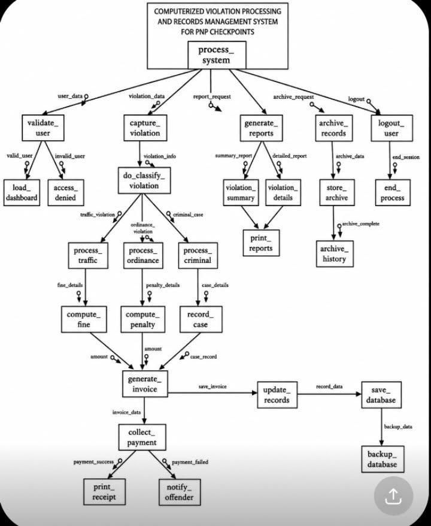

## 📌 Structured Chart

**Description:**

The Structured Chart illustrates the hierarchical organization of the system modules. It shows the relationship between the main program and its submodules, indicating how each module communicates and transfers control during system execution.

