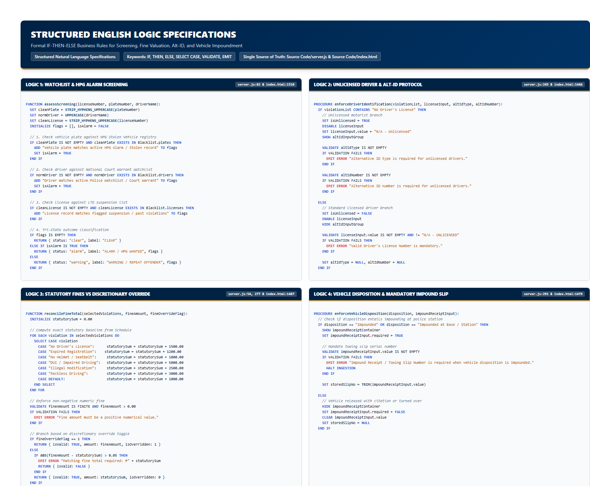

# Structured English Logic Specifications

**System**: PNP Checkpoint Violation Processing & Records Management System (PNP-CVPRMS)  
**Single Source of Truth**: [`Source Code/server.js`](file:///c:/Users/emman/PNP-CVPRMS/Source%20Code/server.js) & [`Source Code/index.html`](file:///c:/Users/emman/PNP-CVPRMS/Source%20Code/index.html)  
**Database**: SQLite (`pnp_checkpoint.db`) — Table: `violations`  

---

## 1. Specification Standards & Keyword Conventions

Structured English is a formalized, unambiguous specification tool used to communicate procedural business logic without programming-language-specific syntactical baggage. 

### Standard Reserved Keywords
* **Conditional Structures**: `IF`, `THEN`, `ELSE IF`, `ELSE`, `END IF`
* **Multi-Branch Selection**: `SELECT CASE`, `CASE`, `CASE DEFAULT`, `END SELECT`
* **Iteration & Loops**: `FOR EACH ... IN`, `WHILE ... DO`, `REPEAT ... UNTIL`, `END FOR`, `END WHILE`
* **Assignments & Actions**: `SET`, `COMPUTE`, `CALL`, `VALIDATE`, `EMIT`, `PROMPT`, `RETURN`
* **Boolean Operators**: `AND`, `OR`, `NOT`

---

## 2. Core Business Logic Specifications



```
================================================================================
LOGIC SPECIFICATION 1: REAL-TIME WATCHLIST & HPG ALARM SCREENING PROTOCOL
================================================================================
MODULE REFERENCE: server.js: assessScreening() [Lines 82-122]
CLIENT REFERENCE: index.html: evaluateLocalScreening() [Lines 1510-1538]
```

```text
FUNCTION assessScreening(licenseNumber, plateNumber, driverName)
    INITIALIZE flags AS empty list
    INITIALIZE isAlarm AS FALSE

    SET normalizedLicense TO CONVERT_TO_UPPERCASE(TRIM(licenseNumber))
    SET normalizedPlate TO CONVERT_TO_UPPERCASE(TRIM(plateNumber))
    SET normalizedDriver TO CONVERT_TO_UPPERCASE(TRIM(driverName))

    // 1. Check Vehicle Plate Against HPG Stolen Vehicle Registry
    SET cleanPlate TO REMOVE_ALL_HYPHENS_AND_SPACES(normalizedPlate)
    SET blacklistPlates TO TRANSFORM_LIST(SCREENING_BLACKLIST.plate_numbers, REMOVE_ALL_HYPHENS_AND_SPACES_UPPERCASE)

    IF cleanPlate IS NOT EMPTY AND cleanPlate EXISTS IN blacklistPlates THEN
        ADD "Vehicle plate matches an active HPG Alarm / Stolen Vehicle record." TO flags
        SET isAlarm TO TRUE
    END IF

    // 2. Check Driver Name Against National Warrant Watchlist
    SET blacklistDrivers TO TRANSFORM_LIST(SCREENING_BLACKLIST.drivers, UPPERCASE)

    IF normalizedDriver IS NOT EMPTY AND normalizedDriver EXISTS IN blacklistDrivers THEN
        ADD "Driver matches an active National Police Watchlist / Court Warrant." TO flags
        SET isAlarm TO TRUE
    END IF

    // 3. Check Driver License Against LTO Suspensions & Revocations
    SET cleanLicense TO REMOVE_ALL_HYPHENS_AND_SPACES(normalizedLicense)
    SET blacklistLicenses TO TRANSFORM_LIST(SCREENING_BLACKLIST.license_numbers, REMOVE_ALL_HYPHENS_AND_SPACES_UPPERCASE)

    IF cleanLicense IS NOT EMPTY AND normalizedLicense DOES NOT CONTAIN "UNLICENSED" THEN
        IF cleanLicense EXISTS IN blacklistLicenses THEN
            ADD "License record matches a flagged suspension or repeat offender record." TO flags
        END IF
    END IF

    // 4. Heuristic Expiration Fallback Detection
    IF flags IS EMPTY THEN
        IF (normalizedLicense DOES NOT CONTAIN "UNLICENSED" AND normalizedLicense CONTAINS "EXPIRED") 
           OR normalizedPlate CONTAINS "EXPIRED" THEN
            ADD "License or plate indicates expired status requiring verification." TO flags
        END IF
    END IF

    // 5. Final Tri-State Decision Classification
    IF flags IS EMPTY THEN
        RETURN {
            status: "clear",
            status_label: "CLEAR",
            flags: ["No screening alerts found in local rule set."]
        }
    ELSE IF isAlarm IS TRUE THEN
        RETURN {
            status: "alarm",
            status_label: "ALARM / HPG WANTED",
            flags: flags
        }
    ELSE
        RETURN {
            status: "warning",
            status_label: "WARNING / REPEAT OFFENDER",
            flags: flags
        }
    END IF
END FUNCTION
```

---

```
================================================================================
LOGIC SPECIFICATION 2: UNLICENSED DRIVER & ALTERNATIVE GOVERNMENT ID PROTOCOL
================================================================================
MODULE REFERENCE: server.js: validateViolationPayload() [Lines 244-264]
CLIENT REFERENCE: index.html: handleLicenseConditionalState() [Lines 1446-1476]
                  index.html: form.onsubmit [Lines 1636-1660]
```

```text
PROCEDURE enforceDriverIdentification(violationList, driverLicenseInput, altIdType, altIdNumber)
    // Determine if apprehension includes unlicensed driving
    IF violationList CONTAINS "No Driver's License" THEN
        SET isUnlicensed TO TRUE
    ELSE
        SET isUnlicensed TO FALSE
    END IF

    IF isUnlicensed IS TRUE THEN
        // Client UI Presentation Rules
        DISABLE driverLicenseInput
        SET driverLicenseInput.value TO "N/A - Unlicensed"
        HIDE driverLicenseInputContainer
        SHOW alternativeIdContainer

        // Mandatory Field Validation Rules
        VALIDATE driverLicenseInput.value EQUALS "N/A - Unlicensed" (IGNORE CASE)
        IF VALIDATION FAILS THEN
            EMIT ERROR "Driver license number must be set to 'N/A - Unlicensed' when 'No Driver's License' is selected."
        END IF

        VALIDATE altIdType IS NOT EMPTY AND altIdType IS NOT NULL
        IF VALIDATION FAILS THEN
            EMIT ERROR "Alternative ID type is required for unlicensed drivers."
        END IF

        VALIDATE altIdNumber IS NOT EMPTY AND TRIM(altIdNumber) IS NOT EMPTY
        IF VALIDATION FAILS THEN
            EMIT ERROR "Alternative ID number is required for unlicensed drivers."
        END IF

    ELSE // Driver claims to possess a valid driver's license
        // Client UI Presentation Rules
        ENABLE driverLicenseInput
        SHOW driverLicenseInputContainer
        HIDE alternativeIdContainer
        CLEAR altIdType
        CLEAR altIdNumber

        // Mandatory Field Validation Rules
        VALIDATE driverLicenseInput.value IS NOT EMPTY AND TRIM(driverLicenseInput.value) IS NOT EMPTY
        IF VALIDATION FAILS THEN
            EMIT ERROR "Driver license number is required."
        END IF

        VALIDATE driverLicenseInput.value DOES NOT EQUAL "N/A - UNLICENSED" (IGNORE CASE)
        IF VALIDATION FAILS THEN
            EMIT ERROR "Driver license number cannot be 'N/A - Unlicensed' unless 'No Driver's License' violation is selected."
        END IF

        SET altIdType TO NULL
        SET altIdNumber TO NULL
    END IF
END PROCEDURE
```

---

```
================================================================================
LOGIC SPECIFICATION 3: STATUTORY FINE CALCULATION VS OFFICER DISCRETIONARY OVERRIDE
================================================================================
MODULE REFERENCE: server.js: calculateViolationTotal() [Lines 54-60]
                  server.js: validateViolationPayload() [Lines 277-289]
CLIENT REFERENCE: index.html: updateFineTotal() [Lines 1487-1493]
                  index.html: fineOverrideToggle.onchange [Lines 1495-1507]
```

```text
FUNCTION calculateAndValidateFine(selectedViolations, fineAmountInput, fineOverrideFlag)
    // 1. Establish Statutory Baseline Fees
    INITIALIZE statutorySum TO 0.00
    SET normalizedViolations TO EXTRACT_UNIQUE_TRIMMED_ITEMS(selectedViolations)

    FOR EACH violation IN normalizedViolations DO
        SELECT CASE violation
            CASE "No Driver's License":
                COMPUTE statutorySum = statutorySum + 1500.00
            CASE "Expired Vehicle Registration":
                COMPUTE statutorySum = statutorySum + 1200.00
            CASE "No Helmet / Seatbelt":
                COMPUTE statutorySum = statutorySum + 1000.00
            CASE "Driving Under the Influence (DUI)":
                COMPUTE statutorySum = statutorySum + 5000.00
            CASE "Illegal Modification":
                COMPUTE statutorySum = statutorySum + 2500.00
            CASE "Reckless Driving":
                COMPUTE statutorySum = statutorySum + 3000.00
            CASE "Failure to Carry Driver's License / OR-CR":
                COMPUTE statutorySum = statutorySum + 1000.00
            CASE "Disregarding Traffic Signs (DTS) / Red Light Violation":
                COMPUTE statutorySum = statutorySum + 1000.00
            CASE "Distracted Driving (RA 10913 - Mobile Device Use)":
                COMPUTE statutorySum = statutorySum + 5000.00
            CASE "Illegal Parking / Obstruction":
                COMPUTE statutorySum = statutorySum + 1000.00
            CASE "Unified Vehicular Volume Reduction Program (Number Coding)":
                COMPUTE statutorySum = statutorySum + 500.00
            CASE "Reckless Driving / Counterflow (Illegal Overtaking)":
                COMPUTE statutorySum = statutorySum + 3000.00
            CASE "Over-speeding":
                COMPUTE statutorySum = statutorySum + 1200.00
            CASE "Defective Equipment / Smoke Belching":
                COMPUTE statutorySum = statutorySum + 1500.00
            CASE DEFAULT:
                COMPUTE statutorySum = statutorySum + 0.00
        END SELECT
    END FOR

    // 2. Validate Positivity of Assessed Fine
    SET assessedFine TO CONVERT_TO_NUMBER(fineAmountInput)
    IF assessedFine IS NOT FINITE OR assessedFine <= 0.00 THEN
        EMIT ERROR "Fine amount must be a positive numerical value."
        RETURN FALSE
    END IF

    // 3. Process Statutory Mode vs Discretionary Override
    IF fineOverrideFlag IS TRUE (fine_override == 1) THEN
        // Discretionary Officer Override Permitted
        // Allow officer-specified assessedFine without statutory sum validation
        RETURN {
            isValid: TRUE,
            fineAmount: assessedFine,
            isOverridden: 1
        }
    ELSE
        // Strict Statutory Enforcement Mode
        COMPUTE fineDifference = ABSOLUTE_VALUE(assessedFine - statutorySum)
        IF fineDifference > 0.05 THEN
            EMIT ERROR "Matching fine total required for selected violations: ₱" + FORMAT_CURRENCY(statutorySum)
            RETURN {
                isValid: FALSE,
                fineAmount: assessedFine,
                expectedAmount: statutorySum,
                isOverridden: 0
            }
        END IF

        RETURN {
            isValid: TRUE,
            fineAmount: statutorySum,
            isOverridden: 0
        }
    END IF
END FUNCTION
```

---

```
================================================================================
LOGIC SPECIFICATION 4: VEHICLE DISPOSITION & MANDATORY IMPOUNDING TOW SLIP
================================================================================
MODULE REFERENCE: server.js: validateViolationPayload() [Lines 290-296]
CLIENT REFERENCE: index.html: vehicleDispositionSelect.onchange [Lines 1479-1484]
                  index.html: form.onsubmit [Lines 1662-1666]
```

```text
PROCEDURE processVehicleDisposition(vehicleDisposition, impoundReceiptInput)
    // Check if apprehension warrants physical impounding
    IF vehicleDisposition EQUALS "Impounded" OR vehicleDisposition EQUALS "Impounded at Base / Station" THEN
        // UI Presentation Rules
        SHOW impoundReceiptInputContainer
        SET impoundReceiptInput.required TO TRUE

        // Validation Rules
        VALIDATE impoundReceiptInput.value IS NOT EMPTY AND TRIM(impoundReceiptInput.value) IS NOT EMPTY
        IF VALIDATION FAILS THEN
            EMIT ERROR "Impound Receipt / Towing Slip Number is required when vehicle disposition is Impounded."
            HALT SUBMISSION
        END IF

        SET storedImpoundReceiptNo TO TRIM(impoundReceiptInput.value)
    ELSE
        // Vehicle released or turned over without station impounding
        HIDE impoundReceiptInputContainer
        SET impoundReceiptInput.required TO FALSE
        CLEAR impoundReceiptInput.value

        SET storedImpoundReceiptNo TO NULL
    END IF
END PROCEDURE
```

---

```
================================================================================
LOGIC SPECIFICATION 5: CONFISCATED DOCUMENT EVIDENCE IMAGE DOWNSCALING
================================================================================
CLIENT REFERENCE: index.html: processEvidenceImage() [Lines 1540-1576]
                  index.html: evidenceFileInput.onchange [Lines 1579-1606]
SERVER REFERENCE: server.js: [Lines 127, 506-508]
```

```text
PROCEDURE processEvidenceImage(selectedFile, callback)
    // 1. Initial Validation on Client
    IF selectedFile.type DOES NOT START WITH "image/" THEN
        CALL showAlert("Selected file must be an image (JPEG, PNG, etc.).", "danger")
        RETURN
    END IF

    IF selectedFile.size > 10 * 1024 * 1024 (10 Megabytes) THEN
        CALL showAlert("Selected photo exceeds 10MB limit. Please choose a smaller image.", "danger")
        RETURN
    END IF

    // 2. Read File via HTML5 FileReader
    INITIALIZE fileReader
    EXECUTE fileReader.readAsDataURL(selectedFile)

    ON fileReader.onload(event):
        CREATE imageObject
        SET imageObject.src TO event.target.result

        ON imageObject.onload():
            SET maxDimension TO 1200
            SET width TO imageObject.width
            SET height TO imageObject.height

            // Calculate Proportional Aspect-Ratio Bounds
            IF width > maxDimension OR height > maxDimension THEN
                IF width > height THEN
                    COMPUTE height = ROUND((height * maxDimension) / width)
                    SET width = maxDimension
                ELSE
                    COMPUTE width = ROUND((width * maxDimension) / height)
                    SET height = maxDimension
                END IF
            END IF

            // Render to Off-Screen HTML5 Canvas
            CREATE canvas WITH dimensions (width, height)
            CALL canvasContext.drawImage(imageObject, 0, 0, width, height)

            // Compress to JPEG Data URL at 82% Quality
            SET compressedDataUrl TO canvas.toDataURL("image/jpeg", 0.82)
            CALL callback(compressedDataUrl)

        ON imageObject.onerror():
            CALL showAlert("Selected file could not be parsed as an image.", "danger")
            CALL callback(NULL)

    ON fileReader.onerror():
        CALL showAlert("Failed to read image file.", "danger")
        CALL callback(NULL)
END PROCEDURE
```

---

```
================================================================================
LOGIC SPECIFICATION 6: REGISTRY SEARCH & MULTI-DIMENSIONAL VIEW FILTERING
================================================================================
CLIENT REFERENCE: index.html: applyFiltersAndRender() [Lines 1826-1856]
SERVER REFERENCE: server.js: GET /api/violations/search [Lines 320-349]
```

```text
PROCEDURE applyFiltersAndRender(allRecords, activeDateFilter, activeStatusFilter, activeShift)
    GET currentDateTime
    SET todayDateString TO FORMAT_DATE(currentDateTime, "YYYY-MM-DD")
    SET sevenDaysAgoDate TO currentDateTime - 7 DAYS

    INITIALIZE visibleRecords AS empty list

    FOR EACH record IN allRecords DO
        SET recordDateString TO SUBSTRING(record.date_recorded, 0, 10)
        SET recordDateTime TO PARSE_ISO_DATE(REPLACE(record.date_recorded, " ", "T"))
        SET includeRecord TO TRUE

        // 1. Date Dimension Filtering
        SELECT CASE activeDateFilter
            CASE "today":
                IF recordDateString != todayDateString THEN
                    SET includeRecord TO FALSE
                END IF
            CASE "7days":
                IF recordDateTime IS INVALID OR recordDateTime < sevenDaysAgoDate THEN
                    SET includeRecord TO FALSE
                END IF
            CASE "shift":
                IF recordDateString != todayDateString OR record.shift_info != activeShift THEN
                    SET includeRecord TO FALSE
                END IF
            CASE "all":
                // No date restriction applied
        END SELECT

        // 2. Status Dimension Filtering
        IF includeRecord IS TRUE THEN
            SET normalizedScreening TO CONVERT_TO_LOWERCASE(record.screening_status)
            SET isFlagged TO (normalizedScreening CONTAINS "alarm" OR normalizedScreening CONTAINS "warning")

            SET paymentText TO record.payment_status
            SET isUnpaid TO (paymentText IS NULL OR paymentText CONTAINS "Unpaid" OR paymentText CONTAINS "Unsettled")

            SELECT CASE activeStatusFilter
                CASE "flagged":
                    IF isFlagged IS FALSE THEN
                        SET includeRecord TO FALSE
                    END IF
                CASE "unpaid":
                    IF isUnpaid IS FALSE THEN
                        SET includeRecord TO FALSE
                    END IF
                CASE "all":
                    // No status restriction applied
            END SELECT
        END IF

        // 3. Collection Accumulation
        IF includeRecord IS TRUE THEN
            ADD record TO visibleRecords
        END IF
    END FOR

    // 4. Render Table and Synchronize Counters
    CALL renderTable(visibleRecords)
    CALL updateSummaryCounters()
END PROCEDURE
```

---

```
================================================================================
LOGIC SPECIFICATION 7: MUNICIPAL TREASURY SETTLEMENT STATUS TRANSITION
================================================================================
MODULE REFERENCE: server.js: PATCH /api/violations/:id/status [Lines 470-500]
CLIENT REFERENCE: index.html: saveStatusFromModal() [Lines 2008-2032]
```

```text
PROCEDURE updateViolationSettlementStatus(violationId, requestedStatus)
    // 1. Validate Identifier
    SET numericId TO PARSE_INTEGER(violationId)
    IF numericId IS NaN OR numericId <= 0 THEN
        RETURN HTTP 400 { success: FALSE, message: "Invalid violation ID parameter." }
    END IF

    // 2. Whitelist Permitted Status Values
    SET allowedStatuses TO [
        "Unsettled / Unpaid",
        "Settled / Paid at Treasury",
        "Voided / Contested"
    ]

    IF requestedStatus IS EMPTY OR requestedStatus NOT IN allowedStatuses THEN
        RETURN HTTP 400 { 
            success: FALSE, 
            message: "Invalid status. Must be one of: " + JOIN(allowedStatuses, ", ") 
        }
    END IF

    // 3. Execute Parameterized Database Update
    EXECUTE SQL:
        UPDATE violations 
        SET payment_status = ? 
        WHERE id = ?
    WITH PARAMS: [requestedStatus, numericId]

    IF SQL_EXECUTION_ERROR THEN
        LOG ERROR
        RETURN HTTP 500 { success: FALSE, message: "Database error updating status." }
    END IF

    IF AFFECTED_ROWS_COUNT == 0 THEN
        RETURN HTTP 404 { success: FALSE, message: "Violation record not found." }
    END IF

    // 4. Return Success & Reactive UI Mutation
    RETURN HTTP 200 {
        success: TRUE,
        message: "Status updated to " + requestedStatus,
        payment_status: requestedStatus
    }
END PROCEDURE
```

---

```
================================================================================
LOGIC SPECIFICATION 8: RFC 4180 COMPLIANT CSV EXPORT WITH EXCEL UTF-8 BOM
================================================================================
CLIENT REFERENCE: index.html: exportVisibleRecords() [Lines 2094-2124]
```

```text
PROCEDURE exportVisibleRecords(visibleRecords)
    IF visibleRecords IS EMPTY THEN
        CALL showAlert("No records to export in the current view.", "danger")
        RETURN
    END IF

    SET columnNames TO [
        "ticket_number", "date_recorded", "shift_info", "checkpoint_post",
        "driver_name", "license_number", "id_type", "id_number",
        "plate_number", "vehicle_type", "vehicle_disposition", "impound_receipt_no",
        "violation_type", "fine_amount", "payment_status", "screening_status", "officer_id"
    ]

    INITIALIZE csvLines AS empty list
    ADD JOIN(columnNames, ",") TO csvLines

    FOR EACH record IN visibleRecords DO
        INITIALIZE lineFields AS empty list

        FOR EACH col IN columnNames DO
            SET rawVal TO record[col]
            IF rawVal IS NULL OR rawVal IS UNDEFINED THEN
                SET cleanVal TO ""
            ELSE
                SET cleanVal TO CONVERT_TO_STRING(rawVal)
            END IF

            // Escape internal double quotes per RFC 4180
            SET escapedVal TO REPLACE_ALL(cleanVal, '"', '""')
            ADD '"' + escapedVal + '"' TO lineFields
        END FOR

        ADD JOIN(lineFields, ",") TO csvLines
    END FOR

    SET csvContentString TO JOIN(csvLines, NEWLINE)

    // Prepend Unicode Byte Order Mark (\uFEFF) for Microsoft Excel UTF-8 Compatibility
    SET utf8BomString TO "\uFEFF" + csvContentString

    CREATE Blob WITH [utf8BomString] AND MIME "text/csv;charset=utf-8;"
    TRIGGER browserFileDownload WITH filename "pnp-cvprms-citations-YYYY-MM-DD.csv"
END PROCEDURE
```
