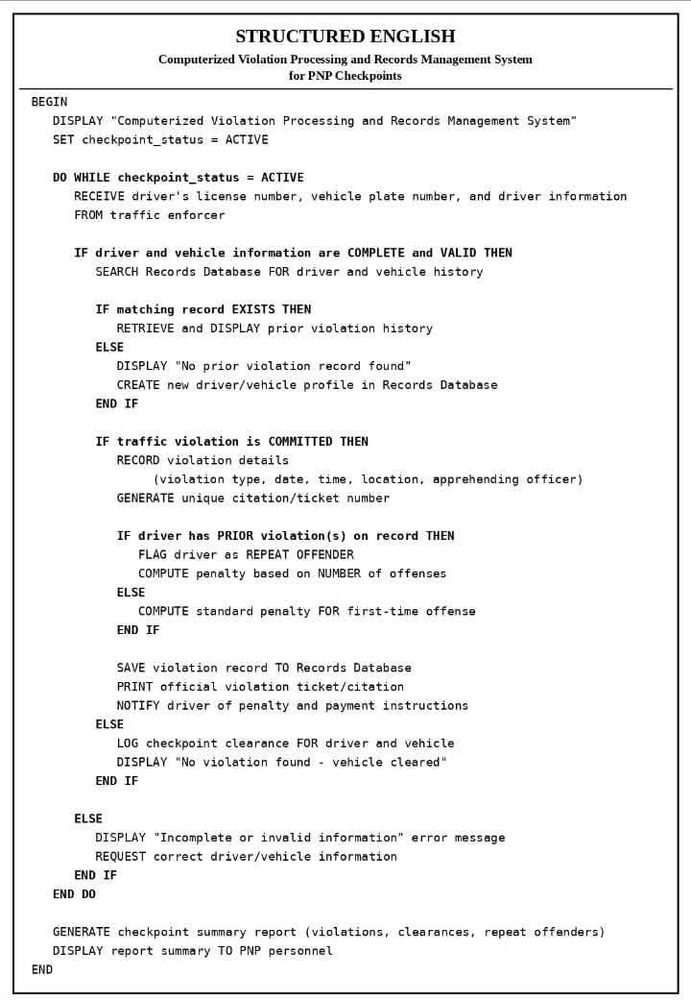

## 📌 Structured English

**Description:**

Structured English documents the business rules and operational logic of the system using simple English statements combined with structured programming constructs such as **IF**, **THEN**, **ELSE**, **WHILE**, and **FOR**. It improves readability and simplifies the translation of business requirements into program code.

