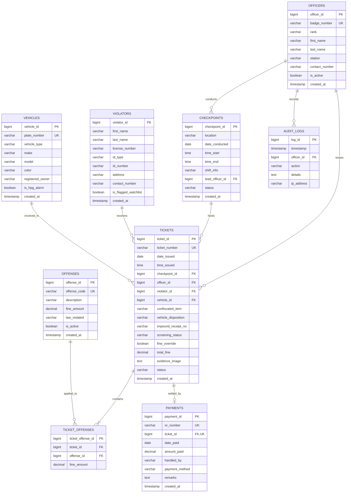

# 🗄️ PNP-CVPRMS Database Schema Documentation

**Philippine National Police — Computerized Violation Processing & Records Management System**  
**Repository Path:** `c:/Users/emman/PNP-CVPRMS/Schema/`  
**Current Version:** `v2.0.0-PRO`  
**Target Station:** `Agoo Municipal Police Station`

---

## 📌 Executive Summary

The **PNP-CVPRMS Database** is engineered to maintain persistent, verifiable, and audit-compliant records of traffic apprehensions, violator credentials, impounded vehicles, issued citation tickets, and treasury settlements.

To meet both operational edge-computing requirements and central law enforcement intelligence needs, the database is architected around two complementary paradigms:

1. **Target Enterprise Relational Architecture (`schema.sql`):**  
   A fully normalized 3NF relational schema designed for central PNP ITMS cloud servers (PostgreSQL / MySQL / MariaDB). It cleanly isolates officers, checkpoints, violators, registered vehicles, standardized statutory offenses, citation tickets, and municipal treasury payments.
2. **Operational Edge / Prototype Architecture (`sqlite_schema.sql`):**  
   An embedded SQLite persistence engine powering the standalone checkpoint terminal and local Node.js/Express server (`Source Code/server.js`). It includes an optimized `violations` table for zero-latency checkpoint ticket generation and thermal citation slip printing, alongside normalized relational tables and cross-compatibility views.

---

## 📐 Entity-Relationship Diagram (ERD)

The following Mermaid diagram visualizes the relational architecture adhering to the system's official Crow's Foot ERD:



---

## 📚 Complete Data Dictionary

### 1. `OFFICERS`
Maintains PNP personnel credentials, badge numbers, ranks, and police station assignments.

| Column Name | Data Type | Key / Constraints | Nullable | Default | Description |
| :--- | :--- | :--- | :---: | :--- | :--- |
| `officer_id` | `BIGINT` | **PK**, Auto Increment | No | Auto | Unique system identifier for the police officer. |
| `badge_number` | `VARCHAR(50)` | **UNIQUE** | No | None | Official PNP badge number (e.g., `PNP-AGO-8821`). |
| `rank` | `VARCHAR(50)` | Standard PNP Rank | No | None | Rank title (e.g., `PEMS`, `PCpl`, `PSSg`, `PCPT`). |
| `first_name` | `VARCHAR(100)` | Standard Text | No | None | First name of the police officer. |
| `last_name` | `VARCHAR(100)` | Standard Text | No | None | Last name / surname of the police officer. |
| `station` | `VARCHAR(150)` | Station Identifier | No | `'Agoo Municipal Police Station'` | Municipal police station where the officer is assigned. |
| `contact_number`| `VARCHAR(50)` | Phone Format | Yes | `NULL` | Duty contact mobile or landline number. |
| `is_active` | `BOOLEAN` | Status Flag | No | `TRUE` | Whether the officer is currently on active duty status. |
| `created_at` | `TIMESTAMP` | Temporal Audit | No | `CURRENT_TIMESTAMP` | System timestamp when officer record was created. |

---

### 2. `CHECKPOINTS`
Logs designated boundary posts, operational checkpoints, schedules, and commanding officers.

| Column Name | Data Type | Key / Constraints | Nullable | Default | Description |
| :--- | :--- | :--- | :---: | :--- | :--- |
| `checkpoint_id` | `BIGINT` | **PK**, Auto Increment | No | Auto | Unique identification number of the checkpoint. |
| `location` | `VARCHAR(255)` | Geographic Name | No | None | Location (e.g., *Boundary Post - Brgy. San Nicolas Norte*). |
| `date_conducted`| `DATE` | ISO Date | No | None | Date when the checkpoint operation was conducted. |
| `time_start` | `TIME` | ISO Time | No | None | Operational start time of the checkpoint duty. |
| `time_end` | `TIME` | ISO Time | Yes | `NULL` | Operational conclusion time of the checkpoint duty. |
| `shift_info` | `VARCHAR(100)` | Operational Shift | Yes | `NULL` | Shift label (*Shift 1: Day*, *Shift 2: Afternoon*, *Shift 3: Night*). |
| `lead_officer_id`| `BIGINT` | **FK** -> `officers(officer_id)` | No | None | Designated team leader / apprehending officer in charge. |
| `status` | `VARCHAR(50)` | Status | No | `'Active'` | Operational state: `'Active'`, `'Concluded'`, `'Cancelled'`. |
| `created_at` | `TIMESTAMP` | Temporal Audit | No | `CURRENT_TIMESTAMP` | Record creation timestamp. |

---

### 3. `VIOLATORS`
Stores identities and identification credentials of apprehended drivers or vehicle operators.

| Column Name | Data Type | Key / Constraints | Nullable | Default | Description |
| :--- | :--- | :--- | :---: | :--- | :--- |
| `violator_id` | `BIGINT` | **PK**, Auto Increment | No | Auto | Unique identification number of the violator. |
| `first_name` | `VARCHAR(100)` | Standard Text | No | None | First name of the apprehended driver. |
| `last_name` | `VARCHAR(100)` | Standard Text | No | None | Last name / surname of the driver. |
| `license_number`| `VARCHAR(50)` | Driver's License | No | None | LTO Driver's License Number or `'N/A - Unlicensed'`. |
| `id_type` | `VARCHAR(50)` | Gov ID Category | Yes | `NULL` | Type of alternative ID (*PhilID / National ID*, *Passport*, *SSS*, etc.). |
| `id_number` | `VARCHAR(100)` | Credential Number | Yes | `NULL` | Government ID serial or identification number. |
| `address` | `VARCHAR(255)` | Residential Address | Yes | `NULL` | Residence address of the driver. |
| `contact_number`| `VARCHAR(50)` | Mobile Number | Yes | `NULL` | Active phone number of the violator. |
| `is_flagged_watchlist` | `BOOLEAN` | Intelligence Alert | No | `FALSE` | Flagged if matching PNP / Court Warrant watchlists. |
| `created_at` | `TIMESTAMP` | Temporal Audit | No | `CURRENT_TIMESTAMP` | Record creation timestamp. |

---

### 4. `VEHICLES`
Maintains motor vehicles screened, inspected, or cited during operations.

| Column Name | Data Type | Key / Constraints | Nullable | Default | Description |
| :--- | :--- | :--- | :---: | :--- | :--- |
| `vehicle_id` | `BIGINT` | **PK**, Auto Increment | No | Auto | Unique identification number of the vehicle. |
| `plate_number` | `VARCHAR(20)` | **UNIQUE** | No | None | Official LTO License Plate or Temporary Conduction Sticker. |
| `vehicle_type` | `VARCHAR(50)` | Classification | No | `'Private/Sedan (UV)'` | Class: *Private/Sedan*, *Motorcycle*, *Tricycle*, *Commercial/Truck*. |
| `make` | `VARCHAR(50)` | Manufacturer | Yes | `NULL` | Manufacturer brand (e.g., *Toyota*, *Honda*, *Yamaha*). |
| `model` | `VARCHAR(50)` | Model Name | Yes | `NULL` | Specific vehicle model (e.g., *Vios*, *Click 125i*). |
| `color` | `VARCHAR(50)` | Body Color | Yes | `NULL` | Primary body exterior paint color. |
| `registered_owner`| `VARCHAR(150)`| Owner Name | Yes | `NULL` | Name on the Official Receipt / Certificate of Registration (OR-CR). |
| `is_hpg_alarm` | `BOOLEAN` | Hotlist Alert | No | `FALSE` | Active Highway Patrol Group (HPG) Stolen Vehicle Alarm flag. |
| `created_at` | `TIMESTAMP` | Temporal Audit | No | `CURRENT_TIMESTAMP` | Record creation timestamp. |

---

### 5. `OFFENSES`
Master statutory catalog of Philippine traffic offenses, penalty schedules, and legal bases.

| Column Name | Data Type | Key / Constraints | Nullable | Default | Description |
| :--- | :--- | :--- | :---: | :--- | :--- |
| `offense_id` | `BIGINT` | **PK**, Auto Increment | No | Auto | Unique identification number of the offense. |
| `offense_code` | `VARCHAR(50)` | **UNIQUE** | No | None | Standard short offense code (e.g., `NL-01`, `DU-04`, `DD-09`). |
| `description` | `VARCHAR(255)` | Violation Name | No | None | Full statutory description of the traffic violation. |
| `fine_amount` | `DECIMAL(10,2)`| Monetary Penalty | No | None | Standard statutory fine in Philippine Pesos (₱). |
| `law_violated` | `VARCHAR(255)` | Legal Basis | No | None | Relevant law (e.g., *JAO 2014-01*, *RA 4136*, *RA 10913*, *RA 10586*). |
| `is_active` | `BOOLEAN` | Enforceability | No | `TRUE` | Whether the violation schedule is active and enforcible. |
| `created_at` | `TIMESTAMP` | Temporal Audit | No | `CURRENT_TIMESTAMP` | Date catalog entry was introduced. |

---

### 6. `TICKETS`
The core transactional entity storing issued Electronic Citation Slips.

| Column Name | Data Type | Key / Constraints | Nullable | Default | Description |
| :--- | :--- | :--- | :---: | :--- | :--- |
| `ticket_id` | `BIGINT` | **PK**, Auto Increment | No | Auto | Unique internal primary key for the citation. |
| `ticket_number`| `VARCHAR(50)` | **UNIQUE** | No | None | Official ticket number (e.g., `PNP-24819201-7F8A2B`). |
| `date_issued` | `DATE` | ISO Date | No | None | Date citation was issued at the checkpoint. |
| `time_issued` | `TIME` | ISO Time | No | None | Exact timestamp citation was issued. |
| `checkpoint_id`| `BIGINT` | **FK** -> `checkpoints` | No | None | Checkpoint post where the apprehension took place. |
| `officer_id` | `BIGINT` | **FK** -> `officers` | No | None | Apprehending officer badge who issued the ticket. |
| `violator_id` | `BIGINT` | **FK** -> `violators` | No | None | Apprehended violator receiving the ticket. |
| `vehicle_id` | `BIGINT` | **FK** -> `vehicles` | No | None | Vehicle involved in the violation. |
| `confiscated_item`| `VARCHAR(255)` | Custody Item | Yes | `NULL` | Confiscated Driver's License, OR-CR, or Plates. |
| `vehicle_disposition`| `VARCHAR(50)`| Vehicle Status | No | `'Released with Citation'` | `'Released with Citation'`, `'Impounded'`, `'Turned Over to HPG'`. |
| `impound_receipt_no` | `VARCHAR(100)`| Custody Slip | Yes | `NULL` | Towing/Impound slip receipt number (required if impounded). |
| `screening_status` | `VARCHAR(50)`| Security Alert | No | `'clear'` | Automated screening outcome: `'clear'`, `'warning'`, `'alarm'`. |
| `fine_override`| `BOOLEAN` | Officer Discretion | No | `FALSE` | Flag indicating officer fine override / discretionary adjustment. |
| `total_fine` | `DECIMAL(10,2)`| Fine Amount | No | `0.00` | Total fine assessed for all combined violations. |
| `evidence_image`| `LONGTEXT` | Media Capture | Yes | `NULL` | Base64-encoded compressed image or URI of photo evidence. |
| `status` | `VARCHAR(50)` | Settlement | No | `'Unsettled / Unpaid'` | Current state: `'Unsettled / Unpaid'`, `'Settled / Paid at Treasury'`, `'Voided / Contested'`. |
| `created_at` | `TIMESTAMP` | System Timestamp | No | `CURRENT_TIMESTAMP` | System recording date and time. |

---

### 7. `TICKET_OFFENSES`
Associative table linking multiple statutory violations to a single citation ticket.

| Column Name | Data Type | Key / Constraints | Nullable | Default | Description |
| :--- | :--- | :--- | :---: | :--- | :--- |
| `ticket_offense_id` | `BIGINT` | **PK**, Auto Increment | No | Auto | Unique record identifier for the association. |
| `ticket_id` | `BIGINT` | **FK** -> `tickets(ticket_id)` | No | None | Target ticket ID (**ON DELETE CASCADE**). |
| `offense_id` | `BIGINT` | **FK** -> `offenses(offense_id)` | No | None | Applied statutory violation (**ON DELETE RESTRICT**). |
| `fine_amount` | `DECIMAL(10,2)`| Assessed Fine | No | None | Monetary fine assessed for this specific offense. |

---

### 8. `PAYMENTS`
Captures citation ticket settlement records processed at the Municipal Treasury.

| Column Name | Data Type | Key / Constraints | Nullable | Default | Description |
| :--- | :--- | :--- | :---: | :--- | :--- |
| `payment_id` | `BIGINT` | **PK**, Auto Increment | No | Auto | Unique system payment record identifier. |
| `or_number` | `VARCHAR(50)` | **UNIQUE** | No | None | Municipal Official Receipt (OR) Number. |
| `ticket_id` | `BIGINT` | **FK**, **UNIQUE** -> `tickets` | No | None | Ticket settled by this payment transaction. |
| `date_paid` | `DATE` | Payment Date | No | None | Date payment was received by Treasury. |
| `amount_paid` | `DECIMAL(10,2)`| Payment Amount | No | None | Exact amount paid in Philippine Pesos (₱). |
| `handled_by` | `VARCHAR(100)`| Cashier Identity | No | None | Municipal cashier / treasury officer name. |
| `payment_method` | `VARCHAR(50)`| Payment Mode | Yes | `'Cash'` | Mode of payment: `'Cash'`, `'Online/Landbank'`, `'GCash'`. |
| `remarks` | `TEXT` | Notes | Yes | `NULL` | Treasury notes, check numbers, or transaction remarks. |
| `created_at` | `TIMESTAMP` | System Timestamp | No | `CURRENT_TIMESTAMP` | Audit timestamp of settlement processing. |

---

### 9. `AUDIT_LOGS`
Tamper-evident trail logging administrative and security actions.

| Column Name | Data Type | Key / Constraints | Nullable | Default | Description |
| :--- | :--- | :--- | :---: | :--- | :--- |
| `log_id` | `BIGINT` | **PK**, Auto Increment | No | Auto | Unique log entry sequence number. |
| `timestamp` | `TIMESTAMP` | Timestamp | No | `CURRENT_TIMESTAMP` | Exact time the system action occurred. |
| `officer_id` | `BIGINT` | **FK** -> `officers` | Yes | `NULL` | Officer or user ID executing the action. |
| `action` | `VARCHAR(100)` | Action Category | No | None | E.g., `'FINE_OVERRIDE'`, `'SETTLEMENT_UPDATE'`, `'VOID_TICKET'`. |
| `details` | `TEXT` | Audit Detail | No | None | Human-readable explanation and parameter delta. |
| `ip_address` | `VARCHAR(45)` | Network Address | Yes | `NULL` | Originating IP address of the terminal. |

---

## ⚖️ Standard Philippine Traffic Offense Schedule

The system comes pre-configured with the statutory penalty schedule enforced by the Philippine National Police, Land Transportation Office (LTO), and local government units (JAO 2014-01 / RA 4136 / RA 10913):

| Offense Code | Violation Name | Fine (₱) | Governing Law / Regulation |
| :--- | :--- | :---: | :--- |
| `NL-01` | No Driver's License | ₱1,500.00 | Republic Act 4136 / JAO 2014-01 Sec. 1(a) |
| `EX-02` | Expired Vehicle Registration | ₱1,200.00 | Republic Act 4136 / JAO 2014-01 Sec. 2(b) |
| `ST-03` | No Helmet / Seatbelt | ₱1,000.00 | Republic Act 10054 / Republic Act 8750 |
| `DU-04` | Driving Under the Influence (DUI) | ₱5,000.00 | Republic Act 10586 (Anti-Drunk & Drugged Driving) |
| `MD-05` | Illegal Modification | ₱2,500.00 | JAO 2014-01 Sec. 2(e) / LTO AO 84-001 |
| `RD-06` | Reckless Driving | ₱3,000.00 | Republic Act 4136 Sec. 48 / JAO 2014-01 |
| `NC-07` | Failure to Carry Driver's License / OR-CR | ₱1,000.00 | Republic Act 4136 Sec. 19 / JAO 2014-01 |
| `TS-08` | Disregarding Traffic Signs (DTS) / Red Light Violation | ₱1,000.00 | Republic Act 4136 Sec. 52 / JAO 2014-01 |
| `DD-09` | Distracted Driving (RA 10913 - Mobile Device Use) | ₱5,000.00 | Republic Act 10913 (Anti-Distracted Driving Act) |
| `IP-10` | Illegal Parking / Obstruction | ₱1,000.00 | Republic Act 4136 Sec. 46 / Municipal Ordinance |
| `UV-11` | Unified Vehicular Volume Reduction Program (Number Coding) | ₱500.00 | MMDA Regulation / Municipal Ordinance |
| `CF-12` | Reckless Driving / Counterflow (Illegal Overtaking) | ₱3,000.00 | Republic Act 4136 Sec. 39-41 / JAO 2014-01 |
| `OS-13` | Over-speeding | ₱1,200.00 | Republic Act 4136 Sec. 35 / JAO 2014-01 |
| `DE-14` | Defective Equipment / Smoke Belching | ₱1,500.00 | Republic Act 8749 (Clean Air Act) / JAO 2014-01 |

---

## 🚀 Deployment and Usage Instructions

### 1. SQLite Prototype Database (Local Development / Testing)
To execute or verify the schema against SQLite:
```bash
# Using SQLite CLI:
sqlite3 Source\ Code/pnp_checkpoint.db < Schema/sqlite_schema.sql

# Using Node.js:
node -e "
const fs = require('fs');
const sqlite3 = require('sqlite3').verbose();
const db = new sqlite3.Database('./Source Code/pnp_checkpoint.db');
db.exec(fs.readFileSync('./Schema/sqlite_schema.sql', 'utf8'), (err) => {
    if (err) console.error('Error:', err);
    else console.log('SQLite Schema initialized successfully.');
    db.close();
});"
```

### 2. Enterprise Relational Database (PostgreSQL / MySQL)
To deploy the target online production schema:
```bash
# PostgreSQL
psql -h <host> -U <user> -d pnp_cvprms -f Schema/schema.sql

# MySQL / MariaDB
mysql -h <host> -u <user> -p pnp_cvprms < Schema/schema.sql
```
