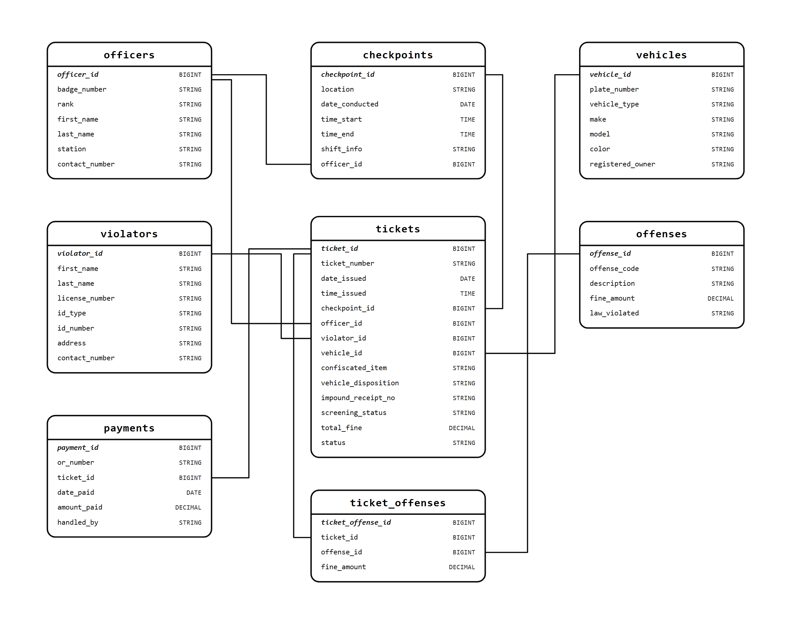

# Database Schema Specification

**System**: PNP Checkpoint Vehicular Passing & Violations Record Management System (PNP-CVPRMS)  
**Database**: SQLite 3 (`pnp_checkpoint.db`) & Relational 3NF Enterprise Architecture  
**Single Source of Truth**: [`Source Code/server.js`](file:///c:/Users/emman/PNP-CVPRMS/Source%20Code/server.js), [`Source Code/index.html`](file:///c:/Users/emman/PNP-CVPRMS/Source%20Code/index.html), and [`Schema/schema.sql`](file:///c:/Users/emman/PNP-CVPRMS/Schema/schema.sql)  
**Last Updated**: October 2026

---

## 1. Schema Overview & Architecture

The database architecture of **PNP-CVPRMS** is structured into a dual-model framework tailored for Philippine National Police field checkpoint conditions:

1. **Enterprise Relational Architecture (Normalized 3NF)**:
   - Modeled for centralized police district or national headquarters servers.
   - Decomposed into 8 normalized relational entities with explicit foreign key integrity constraints, junction tables, and financial reconciliation ledgers as depicted in [`schema_diagram.png`](file:///c:/Users/emman/PNP-CVPRMS/Schema/schema_diagram.png).
2. **Physical Field Deployment Architecture (Optimized Single-Table Edge Model)**:
   - Implemented in [`Source Code/server.js`](file:///c:/Users/emman/PNP-CVPRMS/Source%20Code/server.js) using SQLite 3 (`pnp_checkpoint.db`).
   - Consolidates real-time citation transactions into a single, highly performant `violations` table to guarantee **zero join latency**, **atomic single-write guarantees**, and **resilience against network drops or power outages** at remote roadside checkpoint posts.

---

## 2. Visual Relational Schema Diagram

The diagram below illustrates the complete 8-entity Normalized 3NF Relational Schema including Primary Keys (`BIGINT`), Foreign Key references, data types, and cardinalities:



---

## 3. Enterprise Relational Model Specifications (3NF)

The normalized relational model consists of 8 tables as shown in [`schema_diagram.png`](file:///c:/Users/emman/PNP-CVPRMS/Schema/schema_diagram.png):

### 3.1. `officers` Table
Stores registered PNP personnel authorized to conduct checkpoint operations and issue citations.

| Column | Data Type | Key / Constraint | Description |
| :--- | :--- | :--- | :--- |
| `officer_id` | `BIGINT` | **PK**, NOT NULL | Unique internal officer identifier |
| `badge_number` | `STRING` / `VARCHAR(50)` | UNIQUE, NOT NULL | PNP official badge / serial number |
| `rank` | `STRING` / `VARCHAR(50)` | NOT NULL | Police rank (e.g., Patrolman, PSSg, PCpt) |
| `first_name` | `STRING` / `VARCHAR(100)` | NOT NULL | Officer first name |
| `last_name` | `STRING` / `VARCHAR(100)` | NOT NULL | Officer surname |
| `station` | `STRING` / `VARCHAR(150)` | NOT NULL | Assigned police station / precinct |
| `contact_number` | `STRING` / `VARCHAR(50)` | NULLABLE | Department telephone or mobile contact |

### 3.2. `checkpoints` Table
Records tactical checkpoint operations, locations, and duty schedules.

| Column | Data Type | Key / Constraint | Description |
| :--- | :--- | :--- | :--- |
| `checkpoint_id` | `BIGINT` | **PK**, NOT NULL | Unique checkpoint session identifier |
| `location` | `STRING` / `VARCHAR(255)` | NOT NULL | Road, barangay, or territorial boundary |
| `date_conducted` | `DATE` | NOT NULL | Calendar date of operation (`YYYY-MM-DD`) |
| `time_start` | `TIME` | NOT NULL | Shift commencement time (`HH:MM`) |
| `time_end` | `TIME` | NULLABLE | Shift conclusion time (`HH:MM`) |
| `shift_info` | `STRING` / `VARCHAR(100)` | NOT NULL | Shift classification (Day / Night / Extended) |
| `officer_id` | `BIGINT` | **FK** -> `officers(officer_id)` | Team leader / Officer-in-charge |

### 3.3. `vehicles` Table
Motor vehicle registry tracking vehicle physical attributes and ownership.

| Column | Data Type | Key / Constraint | Description |
| :--- | :--- | :--- | :--- |
| `vehicle_id` | `BIGINT` | **PK**, NOT NULL | Internal vehicle registry key |
| `plate_number` | `STRING` / `VARCHAR(20)` | UNIQUE, NOT NULL | License plate or MV File / conduction sticker |
| `vehicle_type` | `STRING` / `VARCHAR(100)` | NOT NULL | Classification (Sedan, Motorcycle, Truck, UV) |
| `make` | `STRING` / `VARCHAR(100)` | NULLABLE | Manufacturer (Toyota, Honda, Yamaha, etc.) |
| `model` | `STRING` / `VARCHAR(100)` | NULLABLE | Specific vehicle model name |
| `color` | `STRING` / `VARCHAR(50)` | NULLABLE | Predominant exterior vehicle color |
| `registered_owner` | `STRING` / `VARCHAR(255)` | NULLABLE | LTO registered owner on Certificate of Registration |

### 3.4. `violators` Table
Personal profile registry of apprehended drivers and vehicle operators.

| Column | Data Type | Key / Constraint | Description |
| :--- | :--- | :--- | :--- |
| `violator_id` | `BIGINT` | **PK**, NOT NULL | Unique motorist record key |
| `first_name` | `STRING` / `VARCHAR(100)` | NOT NULL | Driver given name |
| `last_name` | `STRING` / `VARCHAR(100)` | NOT NULL | Driver surname |
| `license_number` | `STRING` / `VARCHAR(50)` | NOT NULL | Driver's license number or 'N/A - UNLICENSED' |
| `id_type` | `STRING` / `VARCHAR(100)` | NULLABLE | Secondary ID presented if unlicensed (e.g. UMID, PhilSys) |
| `id_number` | `STRING` / `VARCHAR(100)` | NULLABLE | Identification number from secondary ID |
| `address` | `TEXT` | NULLABLE | Residential address of driver |
| `contact_number` | `STRING` / `VARCHAR(50)` | NULLABLE | Contact telephone / mobile number |

### 3.5. `tickets` Table
Master citation header document generated during an apprehension.

| Column | Data Type | Key / Constraint | Description |
| :--- | :--- | :--- | :--- |
| `ticket_id` | `BIGINT` | **PK**, NOT NULL | Internal ticket database ID |
| `ticket_number` | `STRING` / `VARCHAR(50)` | UNIQUE, NOT NULL | Public citation reference (`PNP-YYYYMMDD-...`) |
| `date_issued` | `DATE` | NOT NULL | Apprehension date |
| `time_issued` | `TIME` | NOT NULL | Apprehension timestamp |
| `checkpoint_id` | `BIGINT` | **FK** -> `checkpoints(checkpoint_id)` | Associated checkpoint post location |
| `officer_id` | `BIGINT` | **FK** -> `officers(officer_id)` | Apprehending officer |
| `violator_id` | `BIGINT` | **FK** -> `violators(violator_id)` | Apprehended driver |
| `vehicle_id` | `BIGINT` | **FK** -> `vehicles(vehicle_id)` | Apprehended vehicle |
| `confiscated_item` | `STRING` / `VARCHAR(255)` | NULLABLE | Confiscated DL, OR/CR, or license plate |
| `vehicle_disposition` | `STRING` / `VARCHAR(100)` | NOT NULL | Disposition (`Released with Citation`, `Impounded`) |
| `impound_receipt_no`| `STRING` / `VARCHAR(50)` | NULLABLE | Technical impound receipt number if impounded |
| `screening_status` | `STRING` / `VARCHAR(50)` | NOT NULL | Watchlist screening outcome (`clear`, `flagged`) |
| `total_fine` | `DECIMAL(10,2)` | NOT NULL | Total payable assessment fine (PHP) |
| `status` | `STRING` / `VARCHAR(50)` | NOT NULL | Settlement status (`Unsettled / Unpaid`, `Settled / Paid`) |

### 3.6. `offenses` Table
Standard catalog of traffic and municipal violations codified under Philippine law and local ordinances.

| Column | Data Type | Key / Constraint | Description |
| :--- | :--- | :--- | :--- |
| `offense_id` | `BIGINT` | **PK**, NOT NULL | Catalog offense key |
| `offense_code` | `STRING` / `VARCHAR(50)` | UNIQUE, NOT NULL | Standard tariff code (e.g. `LTO-NL-01`) |
| `description` | `STRING` / `VARCHAR(255)` | NOT NULL | Violation title (e.g. "Driving without License") |
| `fine_amount` | `DECIMAL(10,2)` | NOT NULL | Statutory penalty fee in Philippine Pesos (PHP) |
| `law_violated` | `STRING` / `VARCHAR(255)` | NOT NULL | Statutory legal basis (e.g. "R.A. 4136 Sec. 19") |

### 3.7. `ticket_offenses` Table
Junction entity supporting many-to-many relationships between tickets and individual offenses.

| Column | Data Type | Key / Constraint | Description |
| :--- | :--- | :--- | :--- |
| `ticket_offense_id` | `BIGINT` | **PK**, NOT NULL | Junction row surrogate key |
| `ticket_id` | `BIGINT` | **FK** -> `tickets(ticket_id)` | Ticket reference |
| `offense_id` | `BIGINT` | **FK** -> `offenses(offense_id)` | Offense catalog reference |
| `fine_amount` | `DECIMAL(10,2)` | NOT NULL | Fine applied (standard statutory or lawful override) |

### 3.8. `payments` Table
Treasury settlement audit trail verifying payment receipt and clearance.

| Column | Data Type | Key / Constraint | Description |
| :--- | :--- | :--- | :--- |
| `payment_id` | `BIGINT` | **PK**, NOT NULL | Settlement transaction ID |
| `or_number` | `STRING` / `VARCHAR(50)` | UNIQUE, NOT NULL | Official Receipt (O.R.) number from municipal treasury |
| `ticket_id` | `BIGINT` | **FK** -> `tickets(ticket_id)` | Paid citation ticket |
| `date_paid` | `DATE` | NOT NULL | Clearance calendar date |
| `amount_paid` | `DECIMAL(10,2)` | NOT NULL | Exact currency amount settled |
| `handled_by` | `STRING` / `VARCHAR(100)` | NOT NULL | Collecting officer or municipal cashier username |

---

## 4. Physical Runtime SQLite Schema (`pnp_checkpoint.db`)

The active application backend ([`Source Code/server.js`](file:///c:/Users/emman/PNP-CVPRMS/Source%20Code/server.js)) deploys an optimized single-table model designed for field terminals:

```sql
CREATE TABLE IF NOT EXISTS violations (
    id                     INTEGER PRIMARY KEY AUTOINCREMENT,
    ticket_number          TEXT NOT NULL UNIQUE,
    driver_name            TEXT NOT NULL,
    license_number         TEXT NOT NULL,
    id_type                TEXT,
    id_number              TEXT,
    plate_number           TEXT NOT NULL,
    vehicle_type           TEXT NOT NULL DEFAULT 'Private/Sedan (UV)',
    vehicle_disposition    TEXT NOT NULL DEFAULT 'Released with Citation',
    impound_receipt_no     TEXT,
    shift_info             TEXT,
    checkpoint_post        TEXT,
    payment_status         TEXT NOT NULL DEFAULT 'Unsettled / Unpaid',
    evidence_image         TEXT,
    fine_override          INTEGER NOT NULL DEFAULT 0,
    violation_type         TEXT NOT NULL,
    fine_amount            REAL NOT NULL,
    officer_id             TEXT NOT NULL,
    date_recorded          TEXT NOT NULL,
    screening_status       TEXT NOT NULL DEFAULT 'clear'
);
```

### Physical Indexing Plan
To guarantee instantaneous auto-complete, wildcard searches, and analytics aggregation across thousands of records, the following B-Tree indexes are deployed:

```sql
CREATE INDEX IF NOT EXISTS idx_violations_plate_number      ON violations(plate_number);
CREATE INDEX IF NOT EXISTS idx_violations_ticket_number     ON violations(ticket_number);
CREATE INDEX IF NOT EXISTS idx_violations_driver_name       ON violations(driver_name);
CREATE INDEX IF NOT EXISTS idx_violations_license_number    ON violations(license_number);
CREATE INDEX IF NOT EXISTS idx_violations_date_recorded     ON violations(date_recorded);
CREATE INDEX IF NOT EXISTS idx_violations_payment_status    ON violations(payment_status);
CREATE INDEX IF NOT EXISTS idx_violations_screening_status  ON violations(screening_status);
CREATE INDEX IF NOT EXISTS idx_violations_officer_id        ON violations(officer_id);
```

---

## 5. Domain Constraints & Validation Rules

| Field / Attribute | Allowed Domain / Constraint Values | Enforcement Mechanism |
| :--- | :--- | :--- |
| `vehicle_disposition` | `'Released with Citation'`, `'Impounded'` | Frontend `<select>` & Backend sanitization |
| `payment_status` | `'Unsettled / Unpaid'`, `'Settled / Paid'` | Direct toggles via `PUT /api/violations/:id/payment` |
| `screening_status` | `'clear'`, `'flagged'` | Evaluated against in-memory security watchlist rules |
| `fine_override` | `0` (Standard tariff) or `1` (Manual supervisor override) | Flagged in SQLite row and citation export |
| `fine_amount` | Strict non-negative decimal: `>= 0.00` | Frontend validator + Backend sanitization |
| `ticket_number` | Strict format: `^PNP-\d{8}-[A-Za-z0-9]{6}$` | Cryptographic PRNG generator in `server.js` |

---

## 6. Edge-to-Enterprise Entity Mapping Matrix

When synchronizing field records from local SQLite terminal instances (`violations`) to the central 3NF enterprise database, field values map across tables as follows:

| Field `violations` Column | Enterprise 3NF Table | Enterprise 3NF Column | Notes |
| :--- | :--- | :--- | :--- |
| `ticket_number` | `tickets` | `ticket_number` | Master citation reference |
| `date_recorded` | `tickets` | `date_issued` / `time_issued` | Extracted into ISO date & time parts |
| `driver_name` | `violators` | `first_name`, `last_name` | Split on whitespace into names |
| `license_number` | `violators` | `license_number` | Foreign key resolved or inserted |
| `id_type`, `id_number` | `violators` | `id_type`, `id_number` | Secondary identity proof |
| `plate_number` | `vehicles` | `plate_number` | Foreign key resolved or inserted |
| `vehicle_type` | `vehicles` | `vehicle_type` | Vehicle classification |
| `officer_id` | `officers` | `officer_id` | Mapped to active duty officer profile |
| `checkpoint_post` | `checkpoints` | `location` | Associated checkpoint operation |
| `shift_info` | `checkpoints` | `shift_info` | Active operational shift |
| `violation_type` | `ticket_offenses` | `offense_id` (via `offenses.description`) | Multi-violation comma split into junction rows |
| `fine_amount` | `tickets` / `ticket_offenses` | `total_fine` / `fine_amount` | Applied penalty fee |
| `vehicle_disposition` | `tickets` | `vehicle_disposition` | Impoundment disposition flag |
| `impound_receipt_no` | `tickets` | `impound_receipt_no` | Chain-of-custody property ticket |
| `payment_status` | `tickets` / `payments` | `status` | Updated upon settlement |
| `screening_status` | `tickets` | `screening_status` | Risk assessment classification |

---

## 7. Associated Files & Scripts

- **SQL DDL Scripts**: [`Schema/schema.sql`](file:///c:/Users/emman/PNP-CVPRMS/Schema/schema.sql)
- **Visual Relational Diagram**: [`Schema/schema_diagram.png`](file:///c:/Users/emman/PNP-CVPRMS/Schema/schema_diagram.png)
- **Active Backend Implementation**: [`Source Code/server.js`](file:///c:/Users/emman/PNP-CVPRMS/Source%20Code/server.js#L158-L232)
- **Data Dictionary**: [`Documentations/Data_Dictionary/DATA_DICTIONARY.md`](file:///c:/Users/emman/PNP-CVPRMS/Documentations/Data_Dictionary/DATA_DICTIONARY.md)
